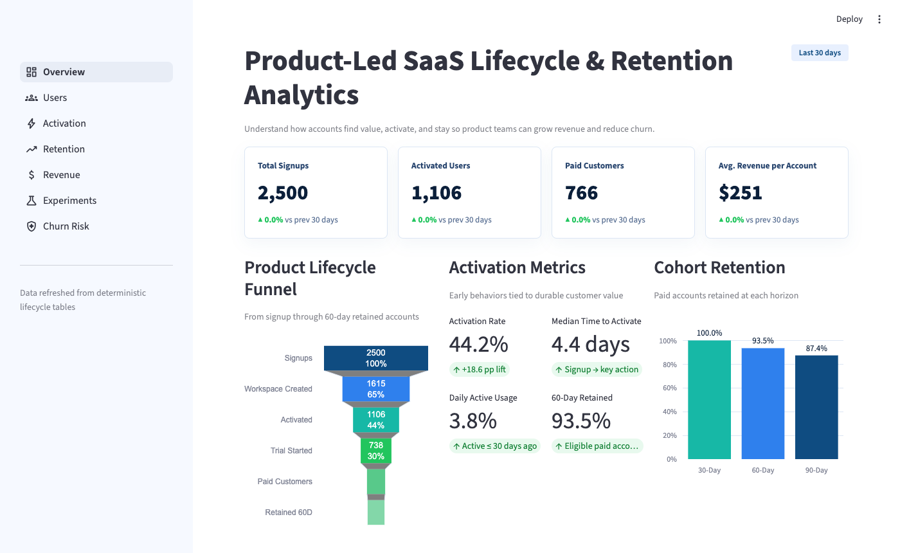

# Product-Led SaaS Lifecycle & Retention Analytics

A product analytics project that connects user behavior to activation, paid conversion, retention, and revenue outcomes.

## Dashboard



**[Dashboard](https://jennypark-saas-analytics.streamlit.app/)**

### Run locally

```bash
# From the project root
python scripts/generate_synthetic_data.py

cd app
pip install -r requirements.txt
streamlit run Summary.py
```

---

## Business Problem

A B2B SaaS company is acquiring new users efficiently, but the customer lifecycle shows leakage after signup:

- Many accounts create a workspace but never complete a key product action within the first 7 days
- Trial users who skip onboarding milestones convert to paid at a significantly lower rate
- Retention differs meaningfully by company size, acquisition source, and early product behavior
- A new guided onboarding experiment shows a large activation lift — but the business impact varies by segment

**The core question:** Are new accounts reaching product value quickly enough to become retained, revenue-generating customers?

---

## Key Findings

### Funnel & Activation

| Finding                                                                                           | Business Implication                                                                                                             |
| ------------------------------------------------------------------------------------------------- | -------------------------------------------------------------------------------------------------------------------------------- |
| paid_search activates at 41.9% vs organic at 46.6%                                                | 5pp gap is not an audience quality problem — workspace creation rates are similar; drop-off concentrates at the integration step |
| Once past activation, paid_search paid conversion (40.5%) trails organic (41.2%) by less than 1pp | Conversion gap is negligible after activation — the lever is activating paid_search accounts, not converting them                |
| integration_connected is the strongest 30-day retention predictor                                 | Onboarding nudges should prioritize API connection, not just workspace creation                                                  |

### Retention

| Finding                                                           | Business Implication                                                                                                                         |
| ----------------------------------------------------------------- | -------------------------------------------------------------------------------------------------------------------------------------------- |
| Paid retention D60: 93% — engagement retention D60: 51%           | These are different metrics answering different questions; conflating them hides that half the signup base disengages before ever converting |
| Activation rate drop was driven by mix shift, not rate regression | Product did not get worse; organic share declined — fix is in acquisition strategy, not onboarding                                           |

### Revenue & Engagement

| Finding                                                                               | Business Implication                                                                                                                                   |
| ------------------------------------------------------------------------------------- | ------------------------------------------------------------------------------------------------------------------------------------------------------ |
| 24-month LTV is nearly identical across channels (paid_search $4,020, organic $4,138) | Channel LTV differences are not statistically meaningful — don't reallocate budget based on LTV ranking alone; get CAC data before drawing conclusions |
| at_risk tier churns at 19.8% vs 4.8% for power users                                  | Engagement tier is a leading indicator — intervene before churn, not after                                                                             |
| Guided onboarding experiment: activation +18.6pp, highly significant (p ≈ 0)          | SHIP to SMB + Mid-Market; paid conversion didn't move alongside activation — track it as a co-primary metric before declaring full success             |

---

## Dashboard Pages

### Overview

Executive summary: KPI trends (vs. prior 30 days), lifecycle funnel, activation metrics, cohort retention, A/B experiment readout, NRR trend, and churn risk segments.

### Users

User distribution by role, organization size, acquisition source, and region. Signup volume over time.

### Activation

7-day activation rate by segment and acquisition source. Time-to-activation distribution. Key action breakdown (workspace creation, integration, project creation).

### Retention

30/60/90-day cohort retention curves by signup month, company size, and acquisition source. Activated vs. non-activated retention comparison.

### Revenue

MRR trend, ARPA by plan, trial-to-paid conversion funnel, and churn reason breakdown.

### Experiments


Onboarding A/B experiment readout: activation lift (+18.6 pp), two-proportion z-test p-value, downstream paid conversion and 60-day retention by variant, guardrail metrics, and segment-level treatment effects.

### Churn Risk


Rules-based risk scoring combining subscription status, 7-day activation, 60-day retention eligibility, and days since last product event. At-risk account list with CS action recommendations.

---

## Analytical Depth

| Analysis                           | Method                                                                                                               | SQL File                        |
| ---------------------------------- | -------------------------------------------------------------------------------------------------------------------- | ------------------------------- |
| Lifecycle funnel                   | Stage-by-stage conversion; step-to-step rates by segment                                                             | `mart_funnel.sql`               |
| Activation                         | 7-day window; milestone → retention predictor; P50/P90 time-to-activate                                              | `mart_activation.sql`           |
| Cohort retention (paid)            | D30/D60/D90 with maturity gating; activated vs. non-activated comparison                                             | `mart_cohort_retention.sql`     |
| Engagement retention               | D30/D60/D90 product-activity retention by signup cohort; gap vs. paid retention surfaces pre-conversion drop-off     | `mart_engagement_retention.sql` |
| A/B experiment                     | Two-proportion z-test; HTE by segment; guardrail metrics                                                             | `mart_experiment.sql`           |
| Multivariate experiment            | A/B/C/D pairwise vs. control; Bonferroni correction; sample size planning                                            | `mart_multivariate.sql`         |
| Root cause analysis                | Mix-shift decomposition (rate effect vs. mix effect); funnel step breakdown                                          | `mart_root_cause.sql`           |
| Revenue & expansion                | MRR trend, ARPA, expansion MRR, churn MRR, NRR, MoM delta                                                            | `mart_revenue.sql`              |
| LTV / max CAC                      | Exposure-based monthly churn, capped LTV with bootstrap intervals, max affordable CAC (no spend data, so no LTV:CAC) | `mart_revenue.sql`              |
| User behavior                      | Prospective (leakage-free, tenure-stratified) test of whether engagement predicts churn                              | `mart_user_behavior.sql`        |
| Usage tiers (planted-signal table) | Weekly usage tiers (power / active / at-risk / dormant) validated prospectively against churn                        | `mart_usage_engagement.sql`     |
| Growth recommendations             | Opportunity sizing: incremental MRR by closing activation gap per segment                                            | `mart_root_cause.sql`           |
| Churn risk                         | Rules-based scoring; CS action framework; MRR at risk                                                                | Dashboard                       |

---

## Data Model

Deterministic synthetic data (seed=42) generated for 2,500 accounts across 5 core tables, plus one optional usage table.

**Read this before drawing conclusions from the data.** It is synthetic, and some of what it contains is by construction: in the core tables, churn is an independent random draw (22% of paying accounts, 30-120 days after paying), unrelated to activity, plan, size or channel, and the event log holds only onboarding events. Findings that say "X does not predict churn" are therefore statements about how the data was generated and demonstrate the method. The one place a signal exists is `usage_weekly` (below), and it is planted on purpose.

```
organizations          — org_id, created_at, industry, company_size, acquisition_source, region
users                  — user_id, org_id, role, signup_timestamp, is_admin
event_logs             — event_id, user_id, org_id, event_name, event_timestamp, event_properties
subscriptions          — subscription_id, org_id, plan_type, mrr_amount, start_date, end_date, status, churn_reason
experiment_assignments — experiment_id, org_id, variant, assigned_at, eligible_segment
```

Optional, generated separately (`generate_usage_dataset`, its own RNG stream; the five core CSVs are read but never modified, and a test checks they are byte-for-byte unchanged):

```
usage_weekly           — org_id, week_start (Monday), active_users, sessions, features_used
```

`usage_weekly` has a **planted signal**: usage is lower for accounts that will churn and declines over the 3-6 weeks before churn; acquisition channel has no effect (a negative control). It exists to check that the prospective churn-prediction method finds a signal that is really there. It says nothing about real customers.

Key events: `signup_completed`, `workspace_created`, `teammate_invited`, `integration_connected`, `project_created`

---

## Tests

Unit and integration tests covering data generation, metric logic, and page rendering:

```bash
python -m pytest tests/ -v
# (one page-rendering test, test_summary_renders_functional_page_links_without_navigation_radio, was already failing before these changes)
```

---

## SQL Practice

BigQuery-style SQL marts covering all analytical domains. Located in `sql/marts/`:

```
sql/marts/
├── mart_funnel.sql               — lifecycle funnel; step-to-step conversion by segment
├── mart_activation.sql           — 7-day activation; milestone → retention predictor; P50/P90
├── mart_cohort_retention.sql     — D30/D60/D90 paid cohort retention; NRR proxy
├── mart_engagement_retention.sql — D30/D60/D90 product-activity retention by signup cohort (vs. paid-only)
├── mart_experiment.sql           — A/B z-test; HTE; guardrail metrics
├── mart_multivariate.sql         — A/B/C/D pairwise; Bonferroni correction; sample size
├── mart_root_cause.sql           — mix-shift decomposition; WoW funnel step breakdown
├── mart_revenue.sql              — MRR, ARPA, expansion MRR, CAC/LTV/payback
├── mart_usage_engagement.sql     — weekly usage tiers (power/active/at-risk/dormant); churn signal
└── mart_user_behavior.sql        — L28 engagement scoring; prospective churn signal detection
```

Full SQL practice guide with business context and interview Q&A: [`process/06_sql_practice.md`](process/06_sql_practice.md)

---

## Tech Stack

| Layer                | Tool                                                           |
| -------------------- | -------------------------------------------------------------- |
| Data generation      | Python (NumPy, Pandas)                                         |
| Metrics and analysis | Python (Pandas, SciPy)                                         |
| SQL analytics        | BigQuery SQL (window functions, CTEs, z-test, cohort patterns) |
| Dashboard            | Streamlit + Plotly                                             |
| Tests                | pytest                                                         |
