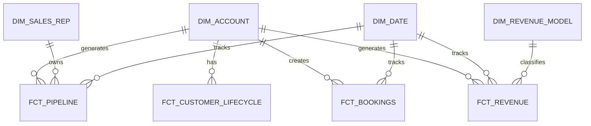

# Revenue Intelligence & GTM Analytics

### A Revenue Intelligence & GTM Analytics Framework for B2B Organizations

> **Connecting GTM activity to revenue — from the first lead to pipeline, bookings, billing, revenue, and retention.**

---

## Dashboard

A 5-page Streamlit dashboard built on synthetic B2B data, designed as an executive-grade revenue intelligence tool.

```bash
cd app
pip install -r requirements.txt
streamlit run Summary.py
```

| Page | Story | Key Questions |
|---|---|---|
| **Summary** | Only 82% of CRM bookings reach the bank — $2.2M disappears across three structural gaps | Where does revenue disappear? Is the pipeline closeable? Is the customer base healthy? |
| **GTM Funnel** | 27% end-to-end win rate — biggest drop at Closed-Won (922 → 325 accounts) | Where does the funnel break? Which lead sources create quality pipeline? |
| **Revenue Reconciliation** | Bookings ≠ Billed ≠ Collected — three distinct gaps with different owners | What is the discount rate? How much is unbilled? Where are failed payments? |
| **Pipeline** | 12% of pipeline is high-risk; 30%+ of deals have gone silent 90+ days | Which deals need action now? What is the realistic forecast? |
| **Customer Health** | 50% healthy accounts; 16% churned; NRR driven by expansion in Enterprise | Who needs CS outreach? Where is expansion opportunity? |

---

## Overview

Revenue data rarely lives in one system.

Marketing owns leads and campaigns.  
Sales owns accounts and opportunities.  
Finance owns billing and revenue.  
Product owns usage and activation.  
Customer Success owns renewals, expansion, and churn.

Each system answers a different question.

The harder question is:

> **How do we connect the entire customer lifecycle into one trusted view of revenue?**

This project builds a **Revenue Intelligence & GTM Analytics Framework** that connects fragmented data across the customer lifecycle and turns it into a consistent foundation for revenue analysis and business decision-making.

The platform is designed for a **scaling B2B technology company with multiple revenue models**, including:

- Subscription
- Advertising
- Usage-based
- Transactional
- Contracted / enterprise services

Rather than building a model around one specific business model, the project establishes a **common revenue lifecycle** that can be adapted across different B2B organizations.

---

# Business Objective

The objective is not to build another dashboard.

The objective is to create a trusted analytical foundation that allows GTM, Sales, Finance, and leadership teams to answer:

> **Where is revenue coming from?**

> **Where does the GTM funnel break?**

> **Which pipeline is most likely to convert?**

> **Why are bookings and revenue different?**

> **Which customers and segments create the most long-term value?**

> **What should the business do next?**

---

# The Core Revenue Lifecycle

The platform is centered around a common B2B revenue lifecycle:

```text
Marketing / Demand Generation
            │
            ▼
          Lead
            │
            ▼
         Account
            │
            ▼
       Opportunity
            │
            ▼
    Contract / Order
            │
            ▼
         Billing
            │
       ┌────┴────┐
       ▼         ▼
   Bookings   Billings
       │         │
       └────┬────┘
            ▼
    Recognized Revenue
            │
       ┌────┴────┐
       ▼         ▼
   Expansion    Churn
       │         │
       └────┬────┘
            ▼
    Customer Value / NRR
```

This structure separates the concepts that are often incorrectly treated as the same metric:

- **Pipeline** — potential future business
- **Bookings** — contracted / won business
- **Billings** — customer invoicing
- **Recognized Revenue** — revenue recognized for financial reporting
- **Expansion** — additional customer value
- **Churn** — lost customer value

This distinction enables more reliable revenue analysis and reconciliation.

---

# Revenue Model Variants

The core model is intentionally business-model agnostic.

Different companies can map their revenue lifecycle into the same analytical framework.

## Subscription Business

```text
Account
   ↓
Opportunity
   ↓
Contract
   ↓
Subscription
   ↓
Billing
   ↓
MRR / ARR
   ↓
Recognized Revenue
```

Typical metrics:

- MRR
- ARR
- Renewal
- Expansion
- Churn
- NRR

---

## Digital Advertising Business

```text
Advertiser Account
       ↓
Opportunity
       ↓
Campaign / Order
       ↓
Media Spend
       ↓
Booked Revenue
       ↓
Delivered Revenue
       ↓
Recognized Revenue
```

Typical metrics:

- Booked revenue
- Campaign revenue
- Media spend
- Delivery
- Revenue attainment
- Account growth
- Advertiser retention

---

## Transactional / Marketplace Business

```text
Account / Buyer
      ↓
Opportunity / Transaction
      ↓
Order
      ↓
Transaction Value
      ↓
Take Rate / Revenue
      ↓
Recognized Revenue
```

Typical metrics:

- Transaction volume
- Gross transaction value
- Revenue
- Take rate
- Account contribution
- Retention

---

## Why This Matters

The analytical framework remains consistent even when the underlying revenue model changes.

```text
Subscription
Advertising
Transactional
Usage-Based
Enterprise Services
       │
       ▼
Common Revenue Model
       │
       ▼
Revenue Intelligence
       │
       ├── Pipeline
       ├── Forecast
       ├── GTM Performance
       ├── Revenue
       └── Retention
```

This makes the project applicable across a broader range of technology and B2B organizations.

---

# Business Problem

A scaling B2B technology company is growing across multiple GTM channels and customer segments.

However, leadership receives different answers depending on which system they use.

For example:

```text
Salesforce
Open / Closed-Won Opportunities
        ≠
Billing System
Invoices / Payments
        ≠
Finance
Recognized Revenue
```

At the same time:

```text
Marketing
    ↓
Leads
    ↓
MQL
    ↓
SQL
    ↓
Opportunity
    ↓
Contract / Order
    ↓
Revenue
    ↓
Retention
```

may exist across multiple disconnected systems.

This creates several business problems:

- Conflicting revenue definitions
- Inconsistent customer identifiers
- Duplicate accounts
- Broken funnel visibility
- Poor pipeline visibility
- Forecast discrepancies
- Revenue reconciliation issues
- Manual reporting
- Low confidence in dashboards
- Difficulty connecting GTM activity to financial outcomes

The problem is therefore not a lack of data.

> **The problem is the lack of a trusted business model connecting GTM activity to revenue.**

---

# Business Questions

The platform is designed around business questions rather than individual dashboards.

## 1. GTM Funnel

- Where does the funnel break?
- Which channels create quality pipeline?
- Which segments convert best?
- How does conversion vary by account size?
- Where is the largest potential revenue leakage?

---

## 2. Pipeline Intelligence

- How much open pipeline exists?
- How much pipeline is at risk?
- Which opportunities are stalled?
- Which deals are likely to slip?
- How much pipeline coverage exists against target?
- Which segments generate the highest-quality pipeline?

---

## 3. Sales Performance

- Which teams create the most pipeline?
- Which segments have the highest win rates?
- What is the average sales cycle?
- Which opportunities take longer than expected?
- How does deal size vary across segments?

---

## 4. Revenue Performance

- How much revenue was booked?
- How much revenue was billed?
- How much revenue was recognized?
- Why do these numbers differ?
- Which segments generate the most revenue?
- Where is revenue growing or declining?

---

## 5. Customer Intelligence

- Which customers are expanding?
- Which customers are at risk of churn?
- Which segments have the strongest retention?
- Which product behaviors correlate with successful conversion?
- Which accounts have the highest long-term value?

---

## 6. GTM Efficiency

- Which acquisition channels generate quality pipeline?
- What is pipeline velocity?
- What is customer acquisition cost?
- How efficiently is sales capacity being used?
- Where should GTM resources be reallocated?

---

# Analytical Framework

The platform connects five major analytical layers:

```text
          GTM
           │
           ▼
       Acquisition
           │
           ▼
        Pipeline
           │
           ▼
       Conversion
           │
           ▼
         Revenue
           │
           ▼
       Retention
           │
           ▼
    Business Decision
```

The analytical goal is to move from:

```text
What happened?
      ↓
Why did it happen?
      ↓
What is likely to happen?
      ↓
What should we do?
```

This is the core Revenue Intelligence workflow.

---

# Example Business Analysis

The project uses the unified data model to investigate GTM performance across segments, channels, and customer characteristics.

Instead of reporting:

> "SQL volume increased."

the analysis asks:

> "Did the additional SQL volume create additional pipeline and revenue?"

For example:

```text
SQL Volume
    ↓
SQL → Opportunity Conversion
    ↓
Pipeline Created
    ↓
Opportunity → Won
    ↓
Booked Revenue
    ↓
Customer Retention
```

This prevents teams from optimizing an upstream metric while downstream business outcomes deteriorate.

---

# Example Finding Framework

Business findings are structured using:

```text
Business Question
       ↓
Metric
       ↓
Segmentation
       ↓
Observed Pattern
       ↓
Root Cause / Driver
       ↓
Business Implication
       ↓
Recommendation
       ↓
Measurement Plan
```

This structure is intentionally designed to demonstrate **business analysis and decision support**, rather than simply descriptive reporting.

---

# Example GTM Finding

### Observation

A channel may generate high lead volume but comparatively weaker downstream conversion.

```text
High Lead Volume
       ↓
Strong MQL Volume
       ↓
Weak SQL → Opportunity
       ↓
Lower Pipeline Creation
       ↓
Lower Revenue Contribution
```

### Business implication

Lead volume alone can overstate channel performance.

### Recommended action

Evaluate acquisition channels based on downstream pipeline and revenue contribution rather than lead volume alone.

### Measurement

Track:

- SQL conversion
- Opportunity creation
- Pipeline generated
- Win rate
- Booked revenue
- Revenue per account

---

# Example Product / GTM Finding

Product engagement can also be used as a contextual signal for revenue analysis.

```text
Product Activation
       ↓
Sales Engagement
       ↓
Opportunity Conversion
       ↓
Win Rate
       ↓
Customer Expansion
```

The purpose is not to claim causality from simple correlation.

Instead, product activity becomes an additional business signal that can help GTM teams:

- Prioritize accounts
- Improve lead scoring
- Identify high-intent customers
- Investigate conversion differences
- Improve sales capacity allocation

---

# Revenue Data Architecture

The platform follows a modern analytical architecture:

```text
Marketing / CRM / Billing / Product / CS / Finance
                       │
                       ▼
                  Raw Data
                       │
                       ▼
                    BigQuery
                       │
                       ▼
                 dbt Staging
                       │
                       ▼
               dbt Intermediate
                       │
                       ▼
                 Revenue Mart
                       │
                       ▼
                Semantic Layer
                       │
             ┌─────────┼─────────┐
             ▼         ▼         ▼
         Dashboard   Analysis    AI
```

The architecture separates:

1. Operational source data
2. Data transformation
3. Business logic
4. Analytical metrics
5. Business consumption

---

# Data Sources

All datasets in this repository are **synthetically generated** for reproducibility.

The synthetic data is designed to simulate realistic GTM and revenue data challenges rather than represent any real company.

## Marketing / Demand Generation

Example fields:

- lead_id
- account_id
- lead_source
- campaign
- channel
- created_at
- lifecycle_stage
- company_size
- segment

---

## CRM / Sales

Example fields:

- account_id
- opportunity_id
- owner_id
- opportunity_stage
- amount
- expected_close_date
- actual_close_date
- created_at
- sales_region
- segment

---

## Contracts / Orders

Example fields:

- contract_id
- account_id
- opportunity_id
- contract_date
- contract_value
- start_date
- end_date
- revenue_model

---

## Billing

Example fields:

- customer_id
- invoice_id
- contract_id
- billing_date
- billing_amount
- payment_status
- currency

---

## Product / Usage

Example fields:

- user_id
- account_id
- event_name
- event_timestamp
- feature_name
- active_users
- activation_event

---

## Customer Success

Example fields:

- account_id
- customer_health_score
- renewal_date
- renewal_status
- expansion_amount
- churn_reason

---

# Production-Like Data Challenges

The synthetic dataset intentionally supports common real-world data quality problems:

- Duplicate accounts
- Missing identifiers
- Orphan opportunities
- Inconsistent customer IDs
- Delayed payments
- Failed payments
- Duplicate contracts
- Close-date changes
- Missing lifecycle events
- Revenue mismatches
- Inconsistent source definitions

This allows the project to demonstrate analysis under imperfect business data rather than assuming a perfectly clean warehouse.

---

# Customer Identity Resolution

One of the central problems in revenue analytics is determining whether records from different systems represent the same customer.

A simplified identity chain is:

```text
Marketing Lead
     ↓
CRM Contact
     ↓
CRM Account
     ↓
Contract / Order
     ↓
Billing Customer
     ↓
Unified Customer Key
```

The project creates a dedicated identity mapping layer.

```text
Marketing ID
CRM Contact ID
CRM Account ID
Billing Customer ID
        │
        ▼
Customer Identity Map
        │
        ▼
Unified Customer Key
```

This mapping makes it possible to connect:

```text
GTM Activity
      ↓
Opportunity
      ↓
Contract / Order
      ↓
Billing
      ↓
Revenue
      ↓
Retention
```

---

# Revenue Reconciliation

A major analytical component is revenue reconciliation.

The platform compares revenue across different business systems.

```text
CRM
Closed-Won / Bookings
        ↓
Contract / Order
        ↓
Billing
        ↓
Recognized Revenue
```

Differences can arise from:

- Missing customer mappings
- Timing differences
- Contract changes
- Cancellations
- Failed payments
- Duplicate records
- Currency differences
- Revenue recognition rules

The goal is not simply to identify that numbers differ.

The goal is to explain:

> **Why do they differ, and which number should be used for which business decision?**

---

# Data Modeling

The project uses a layered dbt architecture:

```text
Raw
 ↓
Staging
 ↓
Intermediate
 ↓
Revenue Mart
 ↓
Semantic Layer
```

## Staging

Responsibilities:

- Standardize column names
- Normalize timestamps
- Normalize identifiers
- Remove duplicates
- Handle nulls
- Apply source-level data quality rules

Example models:

```text
stg_marketing_leads
stg_salesforce_accounts
stg_salesforce_opportunities
stg_contracts
stg_billing
stg_product_events
stg_customer_success
```

---

# Intermediate Models

The intermediate layer contains business relationships that do not belong in raw source models.

Examples:

```text
int_customer_identity_map
int_lead_to_account
int_account_to_opportunity
int_opportunity_to_contract
int_contract_to_revenue
int_customer_lifecycle
```

These models establish the relationships required for lifecycle and revenue analysis.

---

# Revenue Mart

The analytical layer contains reusable fact and dimension models.

Example:

```text
fct_pipeline
fct_bookings
fct_billing
fct_revenue
fct_customer_lifecycle

dim_account
dim_customer
dim_sales_rep
dim_product
dim_date
dim_revenue_model
```

The Revenue Mart is designed to support both dashboarding and deeper analytical workflows.

---

# Core Revenue Model



---

# Revenue Intelligence Metrics

Metrics are organized by business decision.

## Pipeline

### Pipeline Value

```text
SUM(Open Opportunity Amount)
```

### Pipeline Coverage

```text
Open Pipeline
──────────────
Revenue Target
```

### Pipeline Velocity

```text
Opportunities
×
Average Deal Size
×
Win Rate
──────────────
Sales Cycle
```

---

## Funnel

### Lead → MQL

```text
MQLs
────
Leads
```

### MQL → SQL

```text
SQLs
────
MQLs
```

### SQL → Opportunity

```text
Opportunities
─────────────
SQLs
```

### Opportunity → Closed-Won

```text
Closed-Won
──────────
Closed Opportunities
```

---

## Sales

### Win Rate

```text
Closed-Won Opportunities
─────────────────────────
Closed Opportunities
```

### Sales Cycle

```text
Actual Close Date
-
Opportunity Created Date
```

### Average Deal Size

```text
Closed-Won Value
────────────────
Closed-Won Deals
```

---

## Revenue

The model supports revenue metrics appropriate to the underlying business model.

### Bookings

Value of contracts / orders won.

### Billings

Value invoiced to customers.

### Recognized Revenue

Revenue recognized according to the applicable revenue definition.

### MRR / ARR

Used when the underlying revenue model is subscription-based.

```text
ARR = MRR × 12
```

### Expansion

Additional revenue generated from existing customers.

### Churn

Revenue lost from customers who discontinue or reduce business.

### Net Revenue Retention

```text
Starting Revenue
+ Expansion
- Churn
────────────────
Starting Revenue
```

---

# Semantic Layer

A reliable analytics platform requires more than clean tables.

It requires consistent **business definitions**.

Different teams may otherwise define the same metric differently.

For example:

```text
Sales:
Pipeline = Open Opportunities

Finance:
Forecast = Weighted Expected Revenue
```

Both definitions may be useful.

The problem occurs when the organization treats them as the same metric.

---

# Semantic Layer Architecture

```text
Raw Data
   ↓
Business Logic
   ↓
Validated Metrics
   ↓
Semantic Layer
   ↓
 ┌───────────────┬───────────────┐
 ▼               ▼               ▼
Dashboard      Analysis          AI
```

The semantic layer defines:

- Metric name
- Business definition
- Calculation logic
- Filters
- Grain
- Source
- Ownership
- Valid use cases
- Known limitations

This creates a shared analytical language across:

```text
Sales
Finance
GTM Strategy
Leadership
BI
AI
```

---

# AI-Ready Analytics

AI is treated as a **consumer of governed business data**, not as a replacement for the analytical foundation.

The project therefore avoids the pattern:

```text
LLM
 ↓
Raw Database
```

Instead:

```text
Business Question
       ↓
Semantic Context
       ↓
Validated Metrics
       ↓
Approved SQL
       ↓
Warehouse
       ↓
Results
       ↓
Business Insight
       ↓
Recommendation
```

This approach provides AI with:

- Consistent metric definitions
- Business context
- Known dimensions
- Validated calculations
- Controlled data access
- Explainable analytical results

The objective is to make the revenue data foundation **AI-ready**.

---

# Example AI-Assisted Questions

A business leader could ask:

> Why did enterprise pipeline decline this quarter?

The analytical workflow can investigate:

```text
Lead Volume
     ↓
MQL Conversion
     ↓
SQL Conversion
     ↓
Opportunity Creation
     ↓
Pipeline Value
     ↓
Win Rate
     ↓
Sales Cycle
```

Another question:

> Which customer segments should receive additional GTM investment?

The model can compare:

```text
Segment
   ↓
Pipeline
   ↓
Conversion
   ↓
Win Rate
   ↓
Sales Cycle
   ↓
Revenue
   ↓
Expansion
   ↓
Retention
```

The output should ultimately be a **business recommendation**, not simply a chart or SQL query.

---

# Dashboard Strategy

The dashboard is intentionally focused on a small number of decision-oriented views rather than a large collection of disconnected pages.

## 1. Executive Revenue

Designed for leadership.

Key views:

- Bookings
- Billings
- Recognized Revenue
- Pipeline
- Pipeline Coverage
- Forecast vs Actual
- Revenue Growth
- Segment Performance

---

## 2. Pipeline & Forecast

Designed for Sales and GTM Strategy.

Key views:

- Open Pipeline
- Pipeline by Stage
- Pipeline by Segment
- Pipeline Coverage
- At-Risk Opportunities
- Stalled Deals
- Expected Close
- Pipeline Conversion

---

## 3. GTM Performance

Designed for Sales Operations, Marketing, and GTM Strategy.

Key views:

- Funnel Conversion
- Pipeline Generated
- Win Rate
- Sales Cycle
- Channel Performance
- Segment Performance
- Sales Rep Performance
- Revenue Contribution

---

# Opportunity Risk

Pipeline risk is not determined by a single field.

The analysis considers signals such as:

- Days in stage
- Total days open
- Expected sales cycle
- Close-date changes
- Time since last activity
- Opportunity stage
- Deal size
- Historical conversion
- Account segment
- Product engagement

The objective is to provide an **explainable risk classification** rather than an opaque prediction.

Example:

```text
HIGH RISK

Opportunity: Enterprise Account

Signals:
- 42 days in current stage
- Close date pushed twice
- No recent sales activity
- Above-average deal size
- Historical stage conversion below benchmark

Recommended Action:
Prioritize sales review and validate close-date confidence.
```

---

# Data Quality

The platform treats data quality as part of analytics rather than a separate engineering concern.

Example checks include:

```text
Unique Account IDs              ✓
Valid Opportunity IDs           ✓
No Duplicate Opportunities      ✓
Valid Revenue Amounts           ✓
Valid Lifecycle Stages          ✓
Valid Customer Mappings         ✓
No Orphan Revenue Records       ✓
```

The objective is to ensure that downstream metrics are trustworthy before they reach dashboards or AI workflows.

---

# Technical Stack

| Layer                  | Technology                      |
| ---------------------- | ------------------------------- |
| Programming            | Python                          |
| Analytics              | SQL                             |
| Data Warehouse         | BigQuery                        |
| Transformation         | dbt                             |
| Visualization          | Streamlit                       |
| BI / Semantic Modeling | Looker-ready                    |
| Data Quality           | dbt Tests                       |
| Analytics              | Python + SQL                    |
| AI                     | AI-assisted analytical workflow |

> **Note:** Looker is treated as a target BI / semantic layer architecture unless an actual Looker deployment is included in the repository.

---

# Technical Capabilities Demonstrated

## SQL & Analytics

- Advanced SQL
- CTEs
- Window functions
- `LAG()`
- `LEAD()`
- `ROW_NUMBER()`
- `RANK()`
- Cohort analysis
- Funnel analysis
- Revenue analysis
- Segmentation
- Reconciliation analysis

---

## Data Modeling

- Dimensional modeling
- Fact / dimension design
- Customer identity resolution
- Lifecycle modeling
- Revenue modeling
- Semantic modeling
- dbt transformations

---

## Revenue Analytics

- Pipeline analytics
- Bookings
- Billings
- Revenue reconciliation
- Forecast analysis
- Expansion
- Churn
- Retention
- NRR
- Revenue per account

---

## GTM Analytics

- Lead funnel
- Opportunity funnel
- Conversion analysis
- Win rate
- Sales cycle
- Pipeline velocity
- Channel performance
- Segment performance
- Sales capacity analysis

---

## Business Analysis

The project emphasizes:

- Translating business questions into analytical requirements
- Defining metrics
- Identifying drivers
- Segmenting performance
- Reconciling conflicting numbers
- Communicating insights
- Connecting analysis to business actions
- Establishing measurement plans

---

# Repository Structure

```text
.
├── data/
│   └── raw/
│       ├── raw_marketing_leads.csv
│       ├── raw_salesforce_accounts.csv
│       ├── raw_salesforce_opportunities.csv
│       ├── raw_contracts.csv
│       ├── raw_billing.csv
│       ├── raw_product_events.csv
│       └── raw_customer_success.csv
│
├── dbt/
│   ├── models/
│   │   ├── staging/
│   │   │   ├── stg_marketing_leads.sql
│   │   │   ├── stg_salesforce_accounts.sql
│   │   │   ├── stg_salesforce_opportunities.sql
│   │   │   ├── stg_contracts.sql
│   │   │   └── stg_billing.sql
│   │   │
│   │   ├── intermediate/
│   │   │   ├── int_customer_identity_map.sql
│   │   │   ├── int_lead_to_account.sql
│   │   │   ├── int_account_to_opportunity.sql
│   │   │   ├── int_opportunity_to_contract.sql
│   │   │   └── int_contract_to_revenue.sql
│   │   │
│   │   └── marts/
│   │       ├── fct_pipeline.sql
│   │       ├── fct_bookings.sql
│   │       ├── fct_billing.sql
│   │       ├── fct_revenue.sql
│   │       ├── fct_customer_lifecycle.sql
│   │       ├── dim_account.sql
│   │       ├── dim_customer.sql
│   │       ├── dim_sales_rep.sql
│   │       ├── dim_product.sql
│   │       └── dim_date.sql
│
├── scripts/
│   ├── generate_synthetic_data.py
│   ├── run_revenue_reconciliation.py
│   ├── run_pipeline_analysis.py
│   ├── detect_pipeline_risk.py
│   └── generate_ai_insights.py
│
├── app/
│   ├── Summary.py                  ← entry point (streamlit run Summary.py)
│   ├── pages/
│   │   ├── 1_GTM_Funnel.py
│   │   ├── 2_Revenue_Reconciliation.py
│   │   ├── 3_Pipeline.py
│   │   └── 4_Customer_Health.py
│   ├── utils/
│   │   ├── data_loader.py
│   │   └── theme.py
│   └── requirements.txt
│
├── requirements.txt
└── README.md
```

---

# Quickstart

## 1. Clone the Repository

```bash
git clone https://github.com/jinyeong-park/jynlab-revenue-intelligence-platform.git

cd jynlab-revenue-intelligence-platform
```

---

## 2. Create Virtual Environment

```bash
python3 -m venv venv

source venv/bin/activate
```

---

## 3. Install Dependencies

```bash
pip install -r requirements.txt
```

---

## 4. Generate Synthetic Data

```bash
python scripts/generate_synthetic_data.py
```

---

## 5. Run dbt

```bash
dbt run
```

---

## 6. Run Data Quality Tests

```bash
dbt test
```

---

## 7. Run Revenue Reconciliation

```bash
python scripts/run_revenue_reconciliation.py
```

---

## 8. Run Pipeline Analysis

```bash
python scripts/run_pipeline_analysis.py
```

---

## 9. Generate Analytical Insights

```bash
python scripts/generate_ai_insights.py
```

---

## 10. Launch Dashboard

```bash
streamlit run app/Summary.py
```

---

# Project Deliverables

The completed project is intended to demonstrate five connected capabilities:

```text
1. Business Understanding
          ↓
2. Data Modeling
          ↓
3. Revenue & GTM Analytics
          ↓
4. Insight Generation
          ↓
5. Business Recommendation
```

The most important deliverables are therefore:

### 1. Trusted Revenue Model

A unified analytical model connecting:

```text
Account
→ Opportunity
→ Contract / Order
→ Billing
→ Revenue
```

### 2. GTM Funnel Analysis

Identifies conversion gaps and pipeline leakage.

### 3. Pipeline Intelligence

Identifies pipeline health, coverage, and risk.

### 4. Revenue Reconciliation

Explains differences between CRM, billing, and revenue data.

### 5. Semantic Layer

Creates consistent definitions for business metrics.

### 6. Executive Decision Support

Transforms analysis into recommendations that GTM and revenue leaders can act on.

---

# What Makes This a Business Analytics Project?

The technical stack is important, but technology is not the primary objective.

The project follows a business-first workflow:

```text
Business Problem
      ↓
Business Question
      ↓
Metric Definition
      ↓
Data Requirement
      ↓
Data Model
      ↓
Analysis
      ↓
Finding
      ↓
Recommendation
      ↓
Measurement
```

This reflects how analytics is used inside a real GTM organization.

The goal is not:

> "Build a complicated data pipeline."

The goal is:

> **"Create a trusted analytical foundation that helps the business make better revenue decisions."**

---

# Example Decision Framework

When a GTM leader asks:

> "Where should we increase sales capacity?"

the platform should not answer based on pipeline volume alone.

Instead, it evaluates:

```text
Pipeline
   ↓
Conversion
   ↓
Win Rate
   ↓
Sales Cycle
   ↓
Revenue
   ↓
Expansion
   ↓
Retention
```

This enables a more complete decision:

> **Prioritize segments where additional GTM capacity is likely to create the highest incremental revenue impact.**

---

# Business Impact Framework

The project measures impact across four areas.

## Revenue Growth

- Increase pipeline conversion
- Improve win rate
- Increase revenue per account
- Improve expansion

## GTM Efficiency

- Improve sales capacity allocation
- Improve channel quality
- Reduce sales cycle
- Improve pipeline velocity

## Forecast Quality

- Improve pipeline visibility
- Identify at-risk opportunities
- Reconcile CRM and revenue numbers
- Reduce reporting discrepancies

## Operational Efficiency

- Standardize metric definitions
- Reduce manual reporting
- Improve dashboard trust
- Create reusable analytical models

---

# Limitations

This repository uses synthetic data.

Therefore:

- Revenue findings are illustrative.
- Correlations should not automatically be interpreted as causal relationships.
- Business recommendations demonstrate analytical reasoning rather than real company decisions.
- Production integrations are simulated rather than connected to live systems.

The value of the project is in demonstrating the **analytical framework, data model, reasoning process, and decision workflow**.

---

# Future Production Extensions

Potential production extensions include:

- Salesforce API integration
- Billing / ERP integration
- BigQuery scheduled pipelines
- Airflow orchestration
- Production-grade identity resolution
- Advanced revenue forecasting
- Opportunity win-probability modeling
- Sales forecasting
- Customer LTV modeling
- Churn prediction
- Looker semantic model deployment
- Natural-language analytics
- AI-assisted SQL generation
- Automated anomaly detection
- Slack revenue alerts
- Scenario planning
- Quota modeling
- GTM capacity planning

These are intentionally positioned as **future production capabilities**, rather than implying that every capability is already implemented in this portfolio project.

---

# Key Takeaway

Modern Revenue Analytics is not simply about reporting revenue.

It is about connecting:

```text
GTM Activity
     ↓
Accounts
     ↓
Pipeline
     ↓
Bookings
     ↓
Billing
     ↓
Revenue
     ↓
Retention
     ↓
Business Decisions
```

This project demonstrates how a Business Analyst can combine:

- SQL
- Revenue analytics
- GTM analytics
- Data modeling
- Salesforce-to-revenue mapping
- Data reconciliation
- Semantic business logic
- Dashboarding
- AI-ready analytics

to answer a more important question:

> **What should the business do next, and how can we measure whether that decision worked?**

---

## Project Positioning

**Revenue Intelligence & GTM Analytics**

_A unified revenue analytics foundation for B2B GTM organizations._

The framework is intentionally designed to be adaptable across:

- SaaS
- Digital Advertising
- Marketplace
- Fintech
- B2B Technology
- Usage-Based Businesses
- Enterprise Services

while maintaining one consistent analytical principle:

> **Connect GTM activity to revenue, explain the drivers, and turn analysis into action.**
