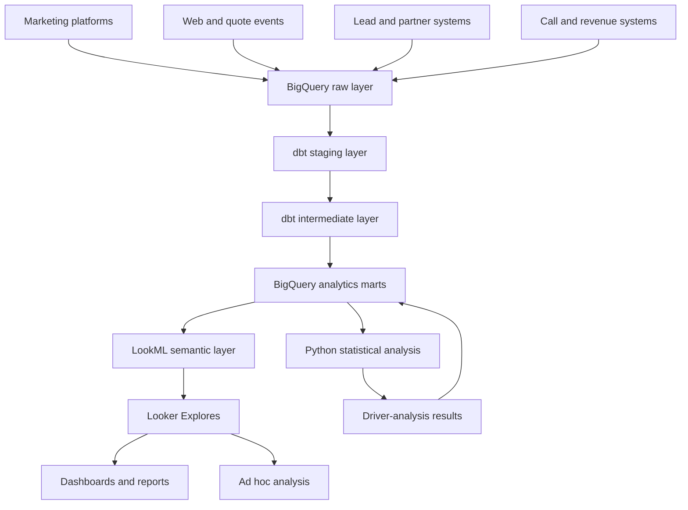

# Lead Funnel Analytics

An end-to-end analytics system built with **BigQuery, SQL, dbt, Looker, LookML, and Python** to measure lead generation, conversion funnels, call routing, partner performance, marketing attribution, and revenue optimization.

The project simulates the analytics environment of a technology-enabled performance-marketing organization serving multiple insurance verticals:

- Auto Insurance
- Home Insurance
- Health Insurance
- Life Insurance

> This is an independent educational project inspired by publicly available business and job requirements. It is not affiliated with Quote.com and does not represent Quote.com’s actual internal systems, data, partners, metrics, or operational processes.

---

## Table of Contents

- [Executive Summary](#executive-summary)
- [Business Context](#business-context)
- [Business Problem](#business-problem)
- [Project Objectives](#project-objectives)
- [Business Questions](#business-questions)
- [System Architecture](#system-architecture)
- [Analytics Delivery Model](#analytics-delivery-model)
- [Insurance Funnel](#insurance-funnel)
- [Data Model and Grain](#data-model-and-grain)
- [Data Sources](#data-sources)
- [BigQuery Design](#bigquery-design)
- [dbt Transformation Layer](#dbt-transformation-layer)
- [Looker and LookML](#looker-and-lookml)
- [Analytics Domains](#analytics-domains)
- [Dashboard Requirements](#dashboard-requirements)
- [Core Metrics](#core-metrics)
- [Marketing Attribution](#marketing-attribution)
- [Call-Routing Analytics](#call-routing-analytics)
- [Partner Performance](#partner-performance)
- [Multivariate Analysis](#multivariate-analysis)
- [Data Quality](#data-quality)
- [Automated Reporting](#automated-reporting)
- [Business Case Studies](#business-case-studies)
- [Repository Structure](#repository-structure)
- [Implementation Phases](#implementation-phases)
- [Definition of Done](#definition-of-done)
- [Known Limitations](#known-limitations)
- [Future Improvements](#future-improvements)

---

# Executive Summary

Insurance performance marketing cannot be evaluated using lead volume or cost per lead alone.

A campaign may generate inexpensive leads but produce:

- Low lead-validity rates
- High duplicate rates
- Poor partner matching
- Low call-connect rates
- Low partner acceptance
- Weak monetization
- Negative contribution margin

Another campaign may have a higher cost per lead but generate substantially more downstream revenue.

This project connects the complete consumer, lead, routing, partner, and revenue journey:

```text
Marketing Spend
        ↓
Website Session
        ↓
Quote Started
        ↓
Lead Submitted
        ↓
Lead Validated
        ↓
Partner Matched
        ↓
Lead or Call Routed
        ↓
Consumer Connected
        ↓
Partner Accepted
        ↓
Revenue Generated
```

The completed analytics system enables marketing, operations, partner management, and leadership teams to:

- Monitor lead-generation performance
- Identify funnel drop-off
- Evaluate lead quality
- Analyze call-routing outcomes
- Compare partner performance
- Reconcile platform and warehouse conversions
- Measure attributed revenue
- Identify acceptance and revenue drivers
- Detect data-quality problems
- Automate recurring reports
- Support pricing and budget decisions

The primary decision supported by the system is:

> Where should the company invest the next marketing dollar to generate the greatest amount of profitable and monetizable demand?

---

# Business Context

The modeled company acquires insurance consumers through:

- Google Paid Search
- Meta Paid Social
- Affiliate Marketing
- Organic Search
- Direct Traffic
- Email
- Referral Partners

Consumers submit quote requests across Auto, Home, Health, and Life Insurance.

Eligible leads may be:

- Sold as digital leads
- Routed to insurance partners
- Connected to partners by phone
- Offered to multiple partners
- Rejected based on geography, product, quality, or capacity
- Monetized through different pricing arrangements

This creates several connected analytics domains:

```text
Marketing Analytics
        +
Consumer Funnel Analytics
        +
Lead-Quality Analytics
        +
Call-Routing Analytics
        +
Partner Analytics
        +
Revenue Analytics
```

The exact internal processes of any real organization may differ. This project models a plausible workflow based on publicly available information and common performance-marketing patterns.

---

# Business Problem

Marketing platforms, website analytics, lead systems, call-routing platforms, partner systems, and revenue records may report different results.

For example:

```text
Marketing Platform
Reports a conversion
        ↓
Warehouse
Records a submitted lead
        ↓
Validation System
Rejects it as a duplicate
        ↓
Partner
Never accepts it
        ↓
Verified Revenue
Equals $0
```

If the company optimizes only toward platform conversions or CPL, it may increase lead volume without increasing revenue.

The analytics system must connect acquisition activity with downstream business outcomes.

---

# Project Objectives

This project is developed as a series of end-to-end analytics vertical slices.

Each business domain follows the same delivery cycle:

```text
Business Question
        ↓
BigQuery Data Model
        ↓
LookML Semantic Definition
        ↓
Looker Explore
        ↓
Dashboard or Ad Hoc Analysis
        ↓
Metric Validation
        ↓
Business Decision
```

Looker and LookML are not treated only as final dashboard tools.

They are used throughout the project to:

- Define governed business metrics
- Describe relationships between analytical entities
- Provide reusable dimensions and measures
- Enable self-service analysis through Explores
- Create dashboards, alerts, and scheduled reports
- Ensure teams use consistent metric definitions

The project delivers six integrated analytics domains.

## 1. Lead and Funnel Analytics

Measure quote activity, lead submission, validation, duplication, acceptance, and monetization.

## 2. Partner and Routing Analytics

Analyze lead matching, routing, delivery, partner response, acceptance, rejection, and capacity.

## 3. Call Analytics

Measure call routing, connection, qualification, abandonment, duration, and call revenue.

## 4. Campaign and Attribution Analytics

Connect marketing spend and customer touchpoints with verified leads and revenue.

## 5. Multivariate Driver Analysis

Identify factors associated with lead acceptance, funnel conversion, and revenue.

## 6. Data Quality and Automated Reporting

Monitor analytical reliability and replace manual recurring reports.

---

# Business Questions

The system should answer questions such as:

- Why did lead volume increase while revenue remained flat?
- Which campaigns generate the highest-quality leads?
- Which channels generate the greatest revenue per lead?
- Where do consumers abandon the quote journey?
- Which partners accept the leads they receive?
- Why did a partner’s acceptance rate decline?
- Which partners should receive more routing volume?
- Which call sources have the highest connection rate?
- Which insurance vertical generates the strongest margin?
- Are inexpensive leads actually profitable?
- Are platform-reported conversions overstated?
- Which factors are associated with lead acceptance?
- Which factors predict lead revenue?
- Is performance driven by channel or differences in product and geographic mix?
- Where should additional marketing budget be allocated?

---

# System Architecture



## Technology Stack

| Layer                 | Technology               |
| --------------------- | ------------------------ |
| Data warehouse        | Google BigQuery          |
| SQL dialect           | BigQuery Standard SQL    |
| Transformation        | dbt                      |
| Semantic layer        | LookML                   |
| Business intelligence | Looker                   |
| Statistical analysis  | Python                   |
| Spreadsheet reporting | Google Sheets or Excel   |
| Version control       | Git and GitHub           |
| Project data          | Synthetic insurance data |

## Responsibility by Layer

| Layer            | Primary responsibility                              |
| ---------------- | --------------------------------------------------- |
| BigQuery         | Store and process analytical data                   |
| dbt              | Transform, test, and document datasets              |
| LookML           | Define business meaning, metrics, and relationships |
| Looker Explore   | Enable self-service and ad hoc analysis             |
| Looker Dashboard | Monitor KPIs and communicate insights               |
| Python           | Generate data and perform statistical analysis      |
| Git and GitHub   | Manage SQL, dbt, and LookML changes                 |

Complex transformations such as deduplication, funnel sequencing, attribution-path construction, and lead-level aggregation are performed primarily in BigQuery and dbt.

Reusable business definitions such as valid leads, accepted leads, qualified calls, revenue per lead, and partner acceptance rate are governed through LookML.

---

# Analytics Delivery Model

The project does not wait until all warehouse work is complete before introducing Looker.

A small end-to-end vertical slice is created early:

```text
Sample Data
    ↓
One BigQuery Mart
    ↓
One LookML View
    ↓
One Explore
    ↓
One Dashboard
    ↓
Metric Validation
```

After the first slice works, the same delivery model is repeated for each business domain.

| Domain       | BigQuery/dbt     | LookML           | Looker                            |
| ------------ | ---------------- | ---------------- | --------------------------------- |
| Lead         | Lead mart        | Lead view        | Lead Explore and dashboard        |
| Funnel       | Funnel mart      | Funnel view      | Funnel Explore and dashboard      |
| Partner      | Partner mart     | Partner view     | Partner Explore and dashboard     |
| Call         | Call mart        | Call view        | Call Explore and dashboard        |
| Campaign     | Campaign mart    | Campaign view    | Campaign Explore and dashboard    |
| Attribution  | Attribution mart | Attribution view | Attribution Explore and dashboard |
| Data quality | Quality mart     | Quality view     | Quality Explore and dashboard     |

This iterative approach allows dashboard and stakeholder requirements to influence warehouse and semantic-layer design before the system becomes difficult to change.

---

# Insurance Funnel

The project models three connected funnels.

## Consumer Funnel

```text
Ad Impression
    ↓
Ad Click
    ↓
Website Session
    ↓
Quote Started
    ↓
Quote Completed
    ↓
Lead Submitted
```

## Operational Lead Funnel

```text
Lead Submitted
    ↓
Lead Validated
    ↓
Partner Matched
    ↓
Lead Routed
    ↓
Lead Delivered
    ↓
Partner Accepted
    ↓
Revenue Generated
```

## Call Funnel

```text
Call Initiated
    ↓
Routing Attempted
    ↓
Partner Answered
    ↓
Consumer Connected
    ↓
Call Qualified
    ↓
Revenue Generated
```

## Funnel Rules

A funnel stage is counted only when:

- It belongs to the correct customer, quote, lead, or call
- It occurs after the preceding eligible stage
- Duplicate events have been removed
- It meets the documented business definition
- It falls within the correct reporting period
- It is not identified as test or fraudulent traffic

The system distinguishes among:

- Customers
- Sessions
- Quotes
- Leads
- Marketing touchpoints
- Routing attempts
- Calls
- Partner responses
- Revenue events

These entities must not be counted interchangeably.

---

# Data Model and Grain

Grain defines what one row represents in a table.

Incorrectly joining tables with different grains can duplicate lead counts, marketing spend, calls, or revenue.

| Table                    | Grain                                         |
| ------------------------ | --------------------------------------------- |
| `dim_customers`          | One row per customer                          |
| `dim_campaigns`          | One row per campaign                          |
| `dim_partners`           | One row per partner                           |
| `fct_ad_performance`     | One row per date, campaign, and DMA           |
| `fct_sessions`           | One row per website session                   |
| `fct_quote_events`       | One row per quote event                       |
| `fct_leads`              | One row per submitted lead                    |
| `fct_routing_attempts`   | One row per lead-partner routing attempt      |
| `fct_calls`              | One row per call                              |
| `fct_call_events`        | One row per call event                        |
| `fct_partner_responses`  | One row per partner response                  |
| `fct_revenue_events`     | One row per revenue event                     |
| `fct_attribution_credit` | One row per conversion, touchpoint, and model |
| `mart_lead_performance`  | One row per lead                              |
| `mart_call_performance`  | One row per call                              |
| `mart_campaign_daily`    | One row per date and campaign                 |
| `mart_partner_daily`     | One row per date and partner                  |

## Fanout Example

One lead may have three routing attempts.

If a lead-level table containing $50 of revenue is joined directly to three routing records, the resulting dataset may incorrectly show $150 of revenue.

The project prevents fanout by:

- Documenting model grain
- Defining reliable primary keys
- Aggregating child records before appropriate joins
- Defining correct LookML relationships
- Separating lead-level and routing-level Explores when necessary
- Validating Looker outputs against controlled BigQuery queries

---

# Data Sources

All public project data is synthetically generated.

The data reproduces common production analytics problems without exposing real customer or company information.

## 1. Marketing Performance

### `raw_ad_performance`

Fields include:

- `performance_date`
- `channel`
- `campaign_id`
- `ad_group_id`
- `insurance_vertical`
- `state`
- `dma_code`
- `spend`
- `impressions`
- `clicks`
- `platform_reported_leads`
- `platform_reported_conversions`
- `platform_reported_revenue`

## 2. Consumer and Quote Events

### `raw_quote_events`

Fields include:

- `event_id`
- `anonymous_id`
- `customer_id`
- `session_id`
- `quote_id`
- `event_timestamp`
- `event_name`
- `page_name`
- `channel`
- `campaign_id`
- `utm_source`
- `utm_medium`
- `utm_campaign`
- `device_type`
- `insurance_vertical`
- `state`
- `dma_code`

Possible event values include:

- `landing_page_view`
- `quote_started`
- `contact_information_completed`
- `insurance_details_completed`
- `quote_completed`
- `lead_submitted`

## 3. Lead Data

### `raw_leads`

Fields include:

- `lead_id`
- `quote_id`
- `customer_id`
- `submitted_at`
- `insurance_vertical`
- `lead_status`
- `lead_quality_score`
- `is_valid`
- `is_duplicate`
- `is_test_lead`
- `is_suspected_fraud`
- `rejection_reason`
- `state`
- `dma_code`

## 4. Routing Data

### `raw_routing_attempts`

Fields include:

- `routing_attempt_id`
- `lead_id`
- `partner_id`
- `routed_at`
- `routing_priority`
- `bid_amount`
- `delivery_status`
- `response_status`
- `response_timestamp`
- `rejection_reason`

## 5. Call Data

### `raw_calls`

Fields include:

- `call_id`
- `lead_id`
- `customer_id`
- `partner_id`
- `call_started_at`
- `call_answered_at`
- `call_connected_at`
- `call_ended_at`
- `call_duration_seconds`
- `talk_time_seconds`
- `routing_status`
- `call_disposition`
- `is_connected`
- `is_qualified_call`
- `is_abandoned`
- `revenue_amount`

## 6. Partner Data

### `raw_partners`

Fields include:

- `partner_id`
- `partner_name`
- `insurance_vertical`
- `active_status`
- `accepted_states`
- `minimum_quality_score`
- `daily_lead_capacity`
- `daily_call_capacity`
- `pricing_model`
- `base_payout`

## 7. Revenue Data

### `raw_revenue_events`

Fields include:

- `revenue_event_id`
- `lead_id`
- `call_id`
- `partner_id`
- `revenue_timestamp`
- `revenue_type`
- `revenue_amount`
- `transaction_status`

---

# BigQuery Design

## Dataset Structure

```text
insurance_analytics_raw
insurance_analytics_staging
insurance_analytics_intermediate
insurance_analytics_marts
insurance_analytics_quality
```

## Partitioning Strategy

| Table            | Partition field           |
| ---------------- | ------------------------- |
| Ad performance   | `performance_date`        |
| Quote events     | `DATE(event_timestamp)`   |
| Leads            | `DATE(submitted_at)`      |
| Routing attempts | `DATE(routed_at)`         |
| Calls            | `DATE(call_started_at)`   |
| Revenue events   | `DATE(revenue_timestamp)` |

## Clustering Candidates

- `campaign_id`
- `insurance_vertical`
- `partner_id`
- `lead_id`
- `state`
- `dma_code`

## BigQuery Practices

The project demonstrates:

- CTEs
- Window functions
- Complex joins
- Subqueries
- Conditional aggregation
- `SAFE_DIVIDE`
- Deduplication
- Partition pruning
- Selecting required columns only
- Query-plan review
- Cost-aware query design
- Incremental dbt models
- Materialized reporting tables

---

# dbt Transformation Layer

## Staging Models

Responsibilities:

- Rename columns consistently
- Standardize channels and campaigns
- Normalize timestamps
- Convert data types
- Remove exact duplicates
- Flag invalid records
- Preserve source-level detail

```text
stg_ad_performance
stg_quote_events
stg_leads
stg_routing_attempts
stg_calls
stg_partners
stg_revenue_events
```

## Intermediate Models

Responsibilities:

- Resolve customer identity
- Sequence consumer events
- Create funnel timestamps
- Summarize routing attempts
- Calculate call outcomes
- Deduplicate revenue
- Construct attribution paths
- Calculate partner response time

```text
int_customer_journeys
int_lead_funnel
int_lead_touchpoints
int_routing_summary
int_call_summary
int_verified_revenue
int_attribution_paths
```

## Analytics Marts

Responsibilities:

- Provide stable, documented models for Looker
- Centralize reusable business logic
- Reduce dashboard query complexity
- Maintain the correct reporting grain

```text
mart_lead_performance
mart_call_performance
mart_campaign_performance
mart_partner_performance
mart_funnel_performance
mart_attribution_performance
mart_data_quality
```

---

# Looker and LookML

Looker is used for:

- Self-service analysis
- Ad hoc investigation
- Data visualization
- Dashboards
- Alerts
- Scheduled report delivery
- Drill-down analysis

LookML provides a governed semantic layer on top of BigQuery.

It defines:

- What fields mean
- How metrics are calculated
- How tables relate
- Which fields analysts can explore
- Which definitions are reused throughout the organization

The intended workflow is:

```text
BigQuery
Stores and calculates data
        ↓
LookML
Defines business meaning
        ↓
Explore
Enables self-service analysis
        ↓
Looker
Visualizes and distributes results
```

Reusable business definitions should be defined in LookML instead of being recreated independently inside dashboard tiles.

## LookML Structure

```text
looker/
├── models/
│   └── insurance_analytics.model.lkml
│
├── views/
│   ├── lead_performance.view.lkml
│   ├── call_performance.view.lkml
│   ├── campaign_performance.view.lkml
│   ├── partner_performance.view.lkml
│   ├── funnel_performance.view.lkml
│   ├── attribution_performance.view.lkml
│   └── data_quality.view.lkml
│
└── dashboards/
    ├── executive_performance.dashboard.lookml
    ├── lead_funnel.dashboard.lookml
    ├── call_routing.dashboard.lookml
    ├── partner_performance.dashboard.lookml
    ├── attribution.dashboard.lookml
    └── data_quality.dashboard.lookml
```

## Example LookML View

```lookml
view: lead_performance {
  sql_table_name:
    `project.insurance_analytics_marts.mart_lead_performance` ;;

  dimension: lead_id {
    primary_key: yes
    type: string
    sql: ${TABLE}.lead_id ;;
  }

  dimension: channel {
    type: string
    sql: ${TABLE}.channel ;;
  }

  dimension: insurance_vertical {
    type: string
    sql: ${TABLE}.insurance_vertical ;;
  }

  dimension: is_valid {
    type: yesno
    sql: ${TABLE}.is_valid ;;
  }

  dimension: is_accepted {
    type: yesno
    sql: ${TABLE}.is_accepted ;;
  }

  dimension_group: submitted {
    type: time
    timeframes: [raw, date, week, month, quarter, year]
    sql: ${TABLE}.submitted_at ;;
  }

  measure: lead_count {
    type: count
  }

  measure: valid_leads {
    type: count
    filters: [is_valid: "Yes"]
  }

  measure: accepted_leads {
    type: count
    filters: [is_accepted: "Yes"]
  }

  measure: total_revenue {
    type: sum
    sql: ${TABLE}.total_revenue ;;
    value_format_name: usd
  }

  measure: acceptance_rate {
    type: number
    sql: SAFE_DIVIDE(${accepted_leads}, ${valid_leads}) ;;
    value_format_name: percent_2
  }

  measure: revenue_per_lead {
    type: number
    sql: SAFE_DIVIDE(${total_revenue}, ${lead_count}) ;;
    value_format_name: usd
  }
}
```

## Example Model and Explores

```lookml
connection: "bigquery_insurance_analytics"

include: "/views/*.view.lkml"
include: "/dashboards/*.dashboard.lookml"

explore: lead_performance {
  label: "Lead Performance"
  description:
    "Lead acquisition, validation, routing, acceptance, and revenue."
}

explore: call_performance {
  label: "Call Performance"
  description:
    "Call routing, connection, qualification, and revenue."
}

explore: campaign_performance {
  label: "Campaign Performance"
}

explore: partner_performance {
  label: "Partner Performance"
}
```

## LookML Concepts Demonstrated

- Projects
- Models
- Views
- Explores
- Dimensions
- Measures
- Dimension groups
- Primary keys
- Join relationships
- Fanout prevention
- Drill fields
- Reusable metrics
- Derived tables
- Persistent derived tables
- Datagroups
- Development Mode
- Production Mode
- Content Validator
- Git-based deployment

---

# Analytics Domains

Each domain includes warehouse modeling, semantic modeling, business-facing analysis, and validation.

## Lead Analytics

- Lead submission
- Lead validity
- Duplicate detection
- Quality score
- Partner matching
- Acceptance
- Monetization

## Funnel Analytics

- Session-to-quote conversion
- Quote completion
- Lead submission
- Funnel drop-off
- Stage duration
- Overall conversion

## Partner Analytics

- Leads offered
- Delivery rate
- Acceptance rate
- Response time
- Rejection reasons
- Capacity utilization
- Revenue per lead

## Call Analytics

- Calls initiated
- Partner answer rate
- Consumer connect rate
- Qualified call rate
- Abandonment
- Call duration
- Call revenue

## Campaign Analytics

- Spend
- Impressions
- Clicks
- CPL
- Valid-lead rate
- Accepted-lead rate
- Revenue per lead
- ROAS
- Contribution margin

## Attribution Analytics

- Platform attribution
- First-touch attribution
- Last-touch attribution
- Linear attribution
- Time-decay attribution
- Position-based attribution

---

# Dashboard Requirements

## 1. Executive Performance Dashboard

### KPI Tiles

- Total spend
- Submitted leads
- Valid leads
- Connected calls
- Qualified calls
- Accepted leads
- Total revenue
- CPL
- Cost per valid lead
- Cost per qualified call
- Cost per accepted lead
- Revenue per lead
- Contribution margin
- ROAS

### Visualizations

- Spend and revenue trend
- Funnel performance
- Revenue by insurance vertical
- Revenue by partner
- CPL versus revenue per lead
- Campaign-performance matrix
- Actual versus target KPIs

## 2. Lead Funnel Dashboard

Displays:

- Sessions
- Quote starts
- Quote completions
- Submitted leads
- Valid leads
- Matched leads
- Routed leads
- Delivered leads
- Accepted leads
- Monetized leads

Includes:

- Stage-to-stage conversion
- Overall conversion
- Drop-off count
- Drop-off rate
- Time between stages
- Channel comparison
- Device comparison
- Insurance vertical comparison

## 3. Call-Routing Dashboard

Displays:

- Calls initiated
- Routing attempts
- Partner answer rate
- Consumer connect rate
- Qualified call rate
- Abandonment rate
- Average speed to answer
- Average talk time
- Revenue per call
- Revenue per qualified call
- Routing failure rate

## 4. Partner Performance Dashboard

Displays:

- Leads offered
- Leads delivered
- Calls offered
- Calls answered
- Leads accepted
- Leads rejected
- Acceptance rate
- Average response time
- Revenue
- Revenue per delivered lead
- Revenue per accepted lead
- Capacity utilization
- Rejection reasons

## 5. Campaign and Attribution Dashboard

Displays:

- Platform-reported conversions
- Verified warehouse conversions
- First-touch attribution
- Last-touch attribution
- Linear attribution
- Time-decay attribution
- Position-based attribution
- Platform ROAS
- Attributed ROAS
- Revenue per lead
- Contribution margin

## 6. Data Quality Dashboard

Displays:

- Duplicate leads
- Duplicate revenue events
- Missing campaign IDs
- Missing UTM values
- Invalid funnel sequences
- Orphan routing records
- Revenue without a valid lead
- Calls without a valid routing record
- Source-to-warehouse discrepancies
- Data freshness

## Global Filters

- Date
- Channel
- Campaign
- Insurance vertical
- State
- DMA
- Device
- Partner
- Lead status
- Call disposition

---

# Core Metrics

## Acquisition

```text
CTR = Clicks / Impressions

CPC = Spend / Clicks

CPL = Spend / Submitted Leads
```

## Lead Quality

```text
Valid Lead Rate = Valid Leads / Submitted Leads

Duplicate Rate = Duplicate Leads / Submitted Leads

Match Rate = Matched Leads / Valid Leads
```

## Routing

```text
Delivery Rate = Delivered Leads / Routing Attempts

Partner Response Rate = Partner Responses / Delivered Leads

Acceptance Rate = Accepted Leads / Delivered Leads
```

## Calls

```text
Partner Answer Rate = Answered Calls / Routed Calls

Connect Rate = Connected Calls / Routed Calls

Qualified Call Rate = Qualified Calls / Connected Calls

Abandonment Rate = Abandoned Calls / Initiated Calls
```

## Funnel

```text
Quote Start Rate = Quote Starts / Sessions

Quote Completion Rate = Completed Quotes / Quote Starts

Lead Submission Rate = Submitted Leads / Quote Starts

Lead-to-Revenue Rate = Monetized Leads / Submitted Leads
```

## Revenue

```text
Revenue per Lead = Revenue / Submitted Leads

Revenue per Valid Lead = Revenue / Valid Leads

Revenue per Accepted Lead = Revenue / Accepted Leads

Revenue per Call = Call Revenue / Routed Calls

ROAS = Revenue / Marketing Spend

Contribution Margin =
Revenue - Marketing Spend - Variable Costs

Margin Rate = Contribution Margin / Revenue
```

All metric definitions must:

- Identify the numerator
- Identify the denominator
- Specify exclusions
- Specify the reporting grain
- Specify time-window rules
- Safely handle zero denominators

---

# Marketing Attribution

The attribution engine links eligible marketing touchpoints to verified conversion or revenue events.

## Attribution Grain

```text
One row per:

conversion_id
+ touchpoint_id
+ attribution_model
```

## Attribution Models

### First Touch

Assigns full credit to the earliest eligible touchpoint.

### Last Touch

Assigns full credit to the final eligible touchpoint before conversion.

### Linear

Distributes credit equally across eligible touchpoints.

### Time Decay

Assigns more credit to touchpoints closer to conversion.

### Position Based

Assigns greater credit to the first and final touchpoints and distributes the remaining credit across middle interactions.

## Requirements

- Use a documented attribution window
- Exclude post-conversion touchpoints
- Separate journeys by conversion
- Define treatment of direct traffic
- Define treatment of missing UTMs
- Prevent credit from exceeding 100%
- Reconcile attributed revenue with verified revenue
- Distinguish attribution from incrementality

## Validation Rules

For every conversion and model:

```text
Sum of attribution credit = 1.0
```

For all eligible conversions:

```text
Total attributed revenue
=
Total eligible verified revenue
```

---

# Call-Routing Analytics

Call routing is modeled separately because one lead may create multiple routing attempts or calls.

## Business Questions

- Which sources generate the greatest number of qualified calls?
- Which partners answer the calls they receive?
- Which partners have the shortest response time?
- Are calls being lost because of routing failures?
- Which time periods have high abandonment?
- Which campaigns produce calls with the highest revenue?
- Does longer talk time correlate with monetization?
- Are partner-capacity constraints suppressing revenue?

## Required Segments

- Channel
- Campaign
- Insurance vertical
- Partner
- Geography
- Device
- Time of day
- Day of week
- Call duration
- Routing priority
- Call disposition

---

# Partner Performance

A partner’s performance should not be judged only by total revenue.

The analysis includes:

- Lead and call volume
- Delivery rate
- Answer rate
- Acceptance rate
- Response time
- Rejection reasons
- Revenue per delivered lead
- Revenue per accepted lead
- Revenue per qualified call
- Capacity utilization
- Product and geographic coverage

## Example Decision Framework

A partner may have:

- Lower total volume
- Higher acceptance
- Faster response
- Higher revenue per lead
- Available capacity

The business may consider increasing routing priority for that partner, subject to contractual and operational constraints.

---

# Multivariate Analysis

Simple channel comparisons may be misleading because channel performance can be affected by:

- Insurance vertical
- Geography
- Device
- Campaign mix
- Lead-quality score
- Partner
- Time of day
- Routing priority
- Customer characteristics

The project includes a multivariable driver-analysis module.

## Analysis 1: Lead-Acceptance Model

### Outcome

```text
is_accepted
```

### Candidate Predictors

- Channel
- Campaign
- Insurance vertical
- State or DMA
- Device
- Lead-quality score
- Submission hour
- Partner
- Routing-attempt number
- Partner response time

### Method

- Logistic regression
- Odds ratios
- Confidence intervals
- Interaction effects
- Model diagnostics

### Business Question

> After controlling for product, geography, lead quality, and partner, is marketing channel still associated with acceptance probability?

## Analysis 2: Revenue-Driver Model

### Outcome

```text
revenue_per_lead
```

### Candidate Methods

- Multiple linear regression
- Log-transformed regression
- Gamma GLM
- Two-part model for zero-heavy revenue

### Business Question

> Which factors are associated with higher lead revenue after accounting for differences in lead and partner mix?

## Analysis 3: Funnel-Conversion Model

### Outcome

```text
quote_completed
```

### Candidate Predictors

- Channel
- Device
- Insurance vertical
- Geography
- Landing page
- Time of day
- Number of form steps
- Page-load category

## Interpretation Rules

- Association must not automatically be described as causation
- Statistical significance must not replace business significance
- Confidence intervals must be reported
- Reference categories must be documented
- Multicollinearity and model fit must be checked
- Observational findings must be distinguished from experiments

---

# Data Quality

Data quality is treated as part of the analytics product.

## Uniqueness

- `lead_id` must be unique in the lead mart
- `call_id` must be unique in the call mart
- `event_id` must be unique in event staging
- `revenue_event_id` must be unique in verified revenue

## Referential Integrity

- Every routing attempt references a valid lead
- Every call references a valid lead or routing record
- Every revenue event references a valid lead or call
- Every campaign maps to a campaign dimension
- Every partner response maps to a routing attempt

## Accepted Values

Tests cover:

- Insurance vertical
- Lead status
- Delivery status
- Partner-response status
- Call disposition
- Revenue transaction status

## Funnel Sequence

```text
quote_started_at
    <= lead_submitted_at
    <= first_routed_at
    <= first_connected_at
    <= first_accepted_at
    <= first_revenue_at
```

## Reconciliation

Compare:

- Platform-reported leads
- Warehouse-submitted leads
- Valid leads
- Delivered leads
- Connected calls
- Partner-accepted leads
- Verified revenue

---

# Automated Reporting

The project demonstrates how manual reporting can be replaced with scheduled analytics.

## Possible Implementations

- Scheduled BigQuery queries
- Scheduled dbt jobs
- Looker dashboard delivery
- Looker alerts
- Data-quality notifications
- Weekly partner-performance reports
- Monthly executive summaries
- Google Sheets or Excel exports

## Alert Examples

- Acceptance rate declines by more than 15%
- Duplicate rate exceeds 5%
- Revenue data is more than 24 hours late
- A campaign exceeds its CPL target
- A partner reaches 90% of capacity
- Call-connect rate falls below target
- Lead volume increases while revenue per lead declines
- Source and warehouse revenue fail reconciliation

---

# Business Case Studies

## Case 1: Lead Volume Increased, Revenue Stayed Flat

Investigation order:

1. Confirm tracking and metric definitions
2. Check channel and campaign mix
3. Check insurance vertical mix
4. Measure valid-lead rate
5. Measure duplicate rate
6. Measure partner match rate
7. Measure call-connect rate
8. Measure partner acceptance
9. Measure revenue per accepted lead
10. Check revenue-reporting lag

## Case 2: Campaign A Has a Lower CPL

Determine whether Campaign A also has:

- A lower valid-lead rate
- A higher duplicate rate
- A lower call-connect rate
- A lower acceptance rate
- Lower revenue per lead
- Lower contribution margin

A lower CPL does not necessarily indicate better performance.

## Case 3: Partner Acceptance Declined

Segment by:

- Insurance vertical
- Geography
- Campaign
- Lead-quality score
- Device
- Time of day
- Routing priority
- Capacity
- Rejection reason

## Case 4: Platform and Warehouse Results Disagree

Check:

- Attribution windows
- Cross-channel overlap
- Duplicate events
- Pixel double-firing
- Missing UTMs
- Time-zone differences
- Conversion definitions
- Failed transactions
- Reporting delays

## Case 5: Call-Connect Rate Declined

Check:

- Partner availability
- Routing failures
- Call time
- Geography
- Product eligibility
- Capacity constraints
- Consumer abandonment
- Data latency
- Telephony-status definitions

## Case 6: Budget Reallocation

Evaluate:

- Marginal CPL
- Valid-lead rate
- Qualified-call rate
- Acceptance rate
- Revenue per lead
- Contribution margin
- Partner capacity
- Statistical uncertainty

---

# Repository Structure

```text
.
├── README.md
├── PROJECT_BRIEF.md
├── ARCHITECTURE.md
├── DATA_DICTIONARY.md
├── METRIC_DEFINITIONS.md
├── DECISION_RULES.md
│
├── data/
│   ├── raw/
│   ├── seeds/
│   └── fixtures/
│
├── scripts/
│   ├── generate_synthetic_data.py
│   ├── load_to_bigquery.py
│   ├── run_driver_analysis.py
│   └── validate_reconciliation.py
│
├── dbt/
│   ├── dbt_project.yml
│   ├── models/
│   │   ├── staging/
│   │   ├── intermediate/
│   │   └── marts/
│   ├── macros/
│   ├── seeds/
│   └── tests/
│
├── sql/
│   ├── ad_hoc/
│   └── validation/
│
├── looker/
│   ├── models/
│   ├── views/
│   └── dashboards/
│
├── notebooks/
│   ├── funnel_analysis.ipynb
│   ├── attribution_analysis.ipynb
│   ├── call_routing_analysis.ipynb
│   ├── partner_analysis.ipynb
│   └── multivariate_analysis.ipynb
│
├── exports/
│   └── weekly_partner_performance.xlsx
│
├── tests/
│   ├── test_data_generation.py
│   └── test_business_rules.py
│
└── docs/
    ├── dashboard_specifications.md
    ├── tracking_plan.md
    ├── attribution_methodology.md
    ├── call_routing_methodology.md
    ├── multivariate_methodology.md
    └── data_quality_runbook.md
```

---

# License

This project is provided for educational and portfolio purposes under the MIT License.
