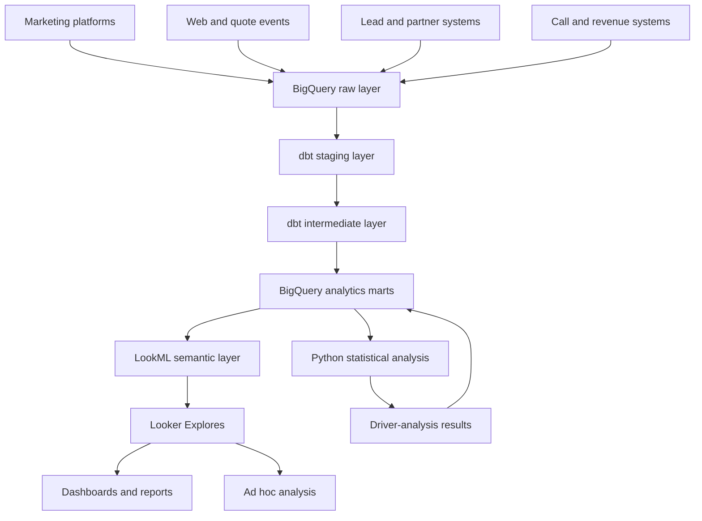

# Lead Funnel Analytics

An end-to-end analytics system built with **BigQuery, SQL, dbt, Looker, LookML, and Python** to measure lead generation, conversion funnels, call routing, partner performance, marketing attribution, and revenue optimization.

The project simulates the analytics environment of a technology-enabled performance-marketing organization serving multiple insurance verticals:

- Auto Insurance
- Home Insurance
- Health Insurance
- Life Insurance

It is designed to function as both:

1. A production-style analytics portfolio project
2. A technical and business interview practice environment

> This is an independent educational project inspired by publicly available business and job requirements. It is not affiliated with Quote.com and does not represent Quote.com’s actual internal systems, data, partners, metrics, or operational processes.

---

## Table of Contents

- [Executive Summary](#executive-summary)
- [Business Context](#business-context)
- [Business Problem](#business-problem)
- [Project Objectives](#project-objectives)
- [Business Questions](#business-questions)
- [System Architecture](#system-architecture)
- [Analytics Delivery Model](#analytics-delivery-model)
- [Insurance Funnel](#insurance-funnel)
- [Data Model and Grain](#data-model-and-grain)
- [Data Sources](#data-sources)
- [BigQuery Design](#bigquery-design)
- [dbt Transformation Layer](#dbt-transformation-layer)
- [Looker and LookML](#looker-and-lookml)
- [Analytics Domains](#analytics-domains)
- [Dashboard Requirements](#dashboard-requirements)
- [Core Metrics](#core-metrics)
- [Marketing Attribution](#marketing-attribution)
- [Call-Routing Analytics](#call-routing-analytics)
- [Partner Performance](#partner-performance)
- [Multivariate Analysis](#multivariate-analysis)
- [Data Quality](#data-quality)
- [Automated Reporting](#automated-reporting)
- [Business Case Studies](#business-case-studies)
- [Interview Practice Lab](#interview-practice-lab)
- [Repository Structure](#repository-structure)
- [Implementation Phases](#implementation-phases)
- [Definition of Done](#definition-of-done)
- [Known Limitations](#known-limitations)
- [Future Improvements](#future-improvements)
- [Skills Demonstrated](#skills-demonstrated)
- [Project Presentation](#project-presentation)

---

# Executive Summary

Insurance performance marketing cannot be evaluated using lead volume or cost per lead alone.

A campaign may generate inexpensive leads but produce:

- Low lead-validity rates
- High duplicate rates
- Poor partner matching
- Low call-connect rates
- Low partner acceptance
- Weak monetization
- Negative contribution margin

Another campaign may have a higher cost per lead but generate substantially more downstream revenue.

This project connects the complete consumer, lead, routing, partner, and revenue journey:

```text
Marketing Spend
        ↓
Website Session
        ↓
Quote Started
        ↓
Lead Submitted
        ↓
Lead Validated
        ↓
Partner Matched
        ↓
Lead or Call Routed
        ↓
Consumer Connected
        ↓
Partner Accepted
        ↓
Revenue Generated
```

The completed analytics system enables marketing, operations, partner management, and leadership teams to:

- Monitor lead-generation performance
- Identify funnel drop-off
- Evaluate lead quality
- Analyze call-routing outcomes
- Compare partner performance
- Reconcile platform and warehouse conversions
- Measure attributed revenue
- Identify acceptance and revenue drivers
- Detect data-quality problems
- Automate recurring reports
- Support pricing and budget decisions

The primary decision supported by the system is:

> Where should the company invest the next marketing dollar to generate the greatest amount of profitable and monetizable demand?

---

# Business Context

The modeled company acquires insurance consumers through:

- Google Paid Search
- Meta Paid Social
- Affiliate Marketing
- Organic Search
- Direct Traffic
- Email
- Referral Partners

Consumers submit quote requests across Auto, Home, Health, and Life Insurance.

Eligible leads may be:

- Sold as digital leads
- Routed to insurance partners
- Connected to partners by phone
- Offered to multiple partners
- Rejected based on geography, product, quality, or capacity
- Monetized through different pricing arrangements

This creates several connected analytics domains:

```text
Marketing Analytics
        +
Consumer Funnel Analytics
        +
Lead-Quality Analytics
        +
Call-Routing Analytics
        +
Partner Analytics
        +
Revenue Analytics
```

The exact internal processes of any real organization may differ. This project models a plausible workflow based on publicly available information and common performance-marketing patterns.

---

# Business Problem

Marketing platforms, website analytics, lead systems, call-routing platforms, partner systems, and revenue records may report different results.

For example:

```text
Marketing Platform
Reports a conversion
        ↓
Warehouse
Records a submitted lead
        ↓
Validation System
Rejects it as a duplicate
        ↓
Partner
Never accepts it
        ↓
Verified Revenue
Equals $0
```

If the company optimizes only toward platform conversions or CPL, it may increase lead volume without increasing revenue.

The analytics system must connect acquisition activity with downstream business outcomes.

---

# Project Objectives

This project is developed as a series of end-to-end analytics vertical slices.

Each business domain follows the same delivery cycle:

```text
Business Question
        ↓
BigQuery Data Model
        ↓
LookML Semantic Definition
        ↓
Looker Explore
        ↓
Dashboard or Ad Hoc Analysis
        ↓
Metric Validation
        ↓
Business Decision
```

Looker and LookML are not treated only as final dashboard tools.

They are used throughout the project to:

- Define governed business metrics
- Describe relationships between analytical entities
- Provide reusable dimensions and measures
- Enable self-service analysis through Explores
- Create dashboards, alerts, and scheduled reports
- Ensure teams use consistent metric definitions

The project delivers six integrated analytics domains.

## 1. Lead and Funnel Analytics

Measure quote activity, lead submission, validation, duplication, acceptance, and monetization.

## 2. Partner and Routing Analytics

Analyze lead matching, routing, delivery, partner response, acceptance, rejection, and capacity.

## 3. Call Analytics

Measure call routing, connection, qualification, abandonment, duration, and call revenue.

## 4. Campaign and Attribution Analytics

Connect marketing spend and customer touchpoints with verified leads and revenue.

## 5. Multivariate Driver Analysis

Identify factors associated with lead acceptance, funnel conversion, and revenue.

## 6. Data Quality and Automated Reporting

Monitor analytical reliability and replace manual recurring reports.

---

# Business Questions

The system should answer questions such as:

- Why did lead volume increase while revenue remained flat?
- Which campaigns generate the highest-quality leads?
- Which channels generate the greatest revenue per lead?
- Where do consumers abandon the quote journey?
- Which partners accept the leads they receive?
- Why did a partner’s acceptance rate decline?
- Which partners should receive more routing volume?
- Which call sources have the highest connection rate?
- Which insurance vertical generates the strongest margin?
- Are inexpensive leads actually profitable?
- Are platform-reported conversions overstated?
- Which factors are associated with lead acceptance?
- Which factors predict lead revenue?
- Is performance driven by channel or differences in product and geographic mix?
- Where should additional marketing budget be allocated?

---

# System Architecture



## Technology Stack

| Layer                 | Technology               |
| --------------------- | ------------------------ |
| Data warehouse        | Google BigQuery          |
| SQL dialect           | BigQuery Standard SQL    |
| Transformation        | dbt                      |
| Semantic layer        | LookML                   |
| Business intelligence | Looker                   |
| Statistical analysis  | Python                   |
| Spreadsheet reporting | Google Sheets or Excel   |
| Version control       | Git and GitHub           |
| Project data          | Synthetic insurance data |

## Responsibility by Layer

| Layer            | Primary responsibility                              |
| ---------------- | --------------------------------------------------- |
| BigQuery         | Store and process analytical data                   |
| dbt              | Transform, test, and document datasets              |
| LookML           | Define business meaning, metrics, and relationships |
| Looker Explore   | Enable self-service and ad hoc analysis             |
| Looker Dashboard | Monitor KPIs and communicate insights               |
| Python           | Generate data and perform statistical analysis      |
| Git and GitHub   | Manage SQL, dbt, and LookML changes                 |

Complex transformations such as deduplication, funnel sequencing, attribution-path construction, and lead-level aggregation are performed primarily in BigQuery and dbt.

Reusable business definitions such as valid leads, accepted leads, qualified calls, revenue per lead, and partner acceptance rate are governed through LookML.

---

# Analytics Delivery Model

The project does not wait until all warehouse work is complete before introducing Looker.

A small end-to-end vertical slice is created early:

```text
Sample Data
    ↓
One BigQuery Mart
    ↓
One LookML View
    ↓
One Explore
    ↓
One Dashboard
    ↓
Metric Validation
```

After the first slice works, the same delivery model is repeated for each business domain.

| Domain       | BigQuery/dbt     | LookML           | Looker                            |
| ------------ | ---------------- | ---------------- | --------------------------------- |
| Lead         | Lead mart        | Lead view        | Lead Explore and dashboard        |
| Funnel       | Funnel mart      | Funnel view      | Funnel Explore and dashboard      |
| Partner      | Partner mart     | Partner view     | Partner Explore and dashboard     |
| Call         | Call mart        | Call view        | Call Explore and dashboard        |
| Campaign     | Campaign mart    | Campaign view    | Campaign Explore and dashboard    |
| Attribution  | Attribution mart | Attribution view | Attribution Explore and dashboard |
| Data quality | Quality mart     | Quality view     | Quality Explore and dashboard     |

This iterative approach allows dashboard and stakeholder requirements to influence warehouse and semantic-layer design before the system becomes difficult to change.

---

# Insurance Funnel

The project models three connected funnels.

## Consumer Funnel

```text
Ad Impression
    ↓
Ad Click
    ↓
Website Session
    ↓
Quote Started
    ↓
Quote Completed
    ↓
Lead Submitted
```

## Operational Lead Funnel

```text
Lead Submitted
    ↓
Lead Validated
    ↓
Partner Matched
    ↓
Lead Routed
    ↓
Lead Delivered
    ↓
Partner Accepted
    ↓
Revenue Generated
```

## Call Funnel

```text
Call Initiated
    ↓
Routing Attempted
    ↓
Partner Answered
    ↓
Consumer Connected
    ↓
Call Qualified
    ↓
Revenue Generated
```

## Funnel Rules

A funnel stage is counted only when:

- It belongs to the correct customer, quote, lead, or call
- It occurs after the preceding eligible stage
- Duplicate events have been removed
- It meets the documented business definition
- It falls within the correct reporting period
- It is not identified as test or fraudulent traffic

The system distinguishes among:

- Customers
- Sessions
- Quotes
- Leads
- Marketing touchpoints
- Routing attempts
- Calls
- Partner responses
- Revenue events

These entities must not be counted interchangeably.

---

# Data Model and Grain

Grain defines what one row represents in a table.

Incorrectly joining tables with different grains can duplicate lead counts, marketing spend, calls, or revenue.

| Table                    | Grain                                         |
| ------------------------ | --------------------------------------------- |
| `dim_customers`          | One row per customer                          |
| `dim_campaigns`          | One row per campaign                          |
| `dim_partners`           | One row per partner                           |
| `fct_ad_performance`     | One row per date, campaign, and DMA           |
| `fct_sessions`           | One row per website session                   |
| `fct_quote_events`       | One row per quote event                       |
| `fct_leads`              | One row per submitted lead                    |
| `fct_routing_attempts`   | One row per lead-partner routing attempt      |
| `fct_calls`              | One row per call                              |
| `fct_call_events`        | One row per call event                        |
| `fct_partner_responses`  | One row per partner response                  |
| `fct_revenue_events`     | One row per revenue event                     |
| `fct_attribution_credit` | One row per conversion, touchpoint, and model |
| `mart_lead_performance`  | One row per lead                              |
| `mart_call_performance`  | One row per call                              |
| `mart_campaign_daily`    | One row per date and campaign                 |
| `mart_partner_daily`     | One row per date and partner                  |

## Fanout Example

One lead may have three routing attempts.

If a lead-level table containing $50 of revenue is joined directly to three routing records, the resulting dataset may incorrectly show $150 of revenue.

The project prevents fanout by:

- Documenting model grain
- Defining reliable primary keys
- Aggregating child records before appropriate joins
- Defining correct LookML relationships
- Separating lead-level and routing-level Explores when necessary
- Validating Looker outputs against controlled BigQuery queries

---

# Data Sources

All public project data is synthetically generated.

The data reproduces common production analytics problems without exposing real customer or company information.

## 1. Marketing Performance

### `raw_ad_performance`

Fields include:

- `performance_date`
- `channel`
- `campaign_id`
- `ad_group_id`
- `insurance_vertical`
- `state`
- `dma_code`
- `spend`
- `impressions`
- `clicks`
- `platform_reported_leads`
- `platform_reported_conversions`
- `platform_reported_revenue`

## 2. Consumer and Quote Events

### `raw_quote_events`

Fields include:

- `event_id`
- `anonymous_id`
- `customer_id`
- `session_id`
- `quote_id`
- `event_timestamp`
- `event_name`
- `page_name`
- `channel`
- `campaign_id`
- `utm_source`
- `utm_medium`
- `utm_campaign`
- `device_type`
- `insurance_vertical`
- `state`
- `dma_code`

Possible event values include:

- `landing_page_view`
- `quote_started`
- `contact_information_completed`
- `insurance_details_completed`
- `quote_completed`
- `lead_submitted`

## 3. Lead Data

### `raw_leads`

Fields include:

- `lead_id`
- `quote_id`
- `customer_id`
- `submitted_at`
- `insurance_vertical`
- `lead_status`
- `lead_quality_score`
- `is_valid`
- `is_duplicate`
- `is_test_lead`
- `is_suspected_fraud`
- `rejection_reason`
- `state`
- `dma_code`

## 4. Routing Data

### `raw_routing_attempts`

Fields include:

- `routing_attempt_id`
- `lead_id`
- `partner_id`
- `routed_at`
- `routing_priority`
- `bid_amount`
- `delivery_status`
- `response_status`
- `response_timestamp`
- `rejection_reason`

## 5. Call Data

### `raw_calls`

Fields include:

- `call_id`
- `lead_id`
- `customer_id`
- `partner_id`
- `call_started_at`
- `call_answered_at`
- `call_connected_at`
- `call_ended_at`
- `call_duration_seconds`
- `talk_time_seconds`
- `routing_status`
- `call_disposition`
- `is_connected`
- `is_qualified_call`
- `is_abandoned`
- `revenue_amount`

## 6. Partner Data

### `raw_partners`

Fields include:

- `partner_id`
- `partner_name`
- `insurance_vertical`
- `active_status`
- `accepted_states`
- `minimum_quality_score`
- `daily_lead_capacity`
- `daily_call_capacity`
- `pricing_model`
- `base_payout`

## 7. Revenue Data

### `raw_revenue_events`

Fields include:

- `revenue_event_id`
- `lead_id`
- `call_id`
- `partner_id`
- `revenue_timestamp`
- `revenue_type`
- `revenue_amount`
- `transaction_status`

---

# BigQuery Design

## Dataset Structure

```text
insurance_analytics_raw
insurance_analytics_staging
insurance_analytics_intermediate
insurance_analytics_marts
insurance_analytics_quality
```

## Partitioning Strategy

| Table            | Partition field           |
| ---------------- | ------------------------- |
| Ad performance   | `performance_date`        |
| Quote events     | `DATE(event_timestamp)`   |
| Leads            | `DATE(submitted_at)`      |
| Routing attempts | `DATE(routed_at)`         |
| Calls            | `DATE(call_started_at)`   |
| Revenue events   | `DATE(revenue_timestamp)` |

## Clustering Candidates

- `campaign_id`
- `insurance_vertical`
- `partner_id`
- `lead_id`
- `state`
- `dma_code`

## BigQuery Practices

The project demonstrates:

- CTEs
- Window functions
- Complex joins
- Subqueries
- Conditional aggregation
- `SAFE_DIVIDE`
- Deduplication
- Partition pruning
- Selecting required columns only
- Query-plan review
- Cost-aware query design
- Incremental dbt models
- Materialized reporting tables

---

# dbt Transformation Layer

## Staging Models

Responsibilities:

- Rename columns consistently
- Standardize channels and campaigns
- Normalize timestamps
- Convert data types
- Remove exact duplicates
- Flag invalid records
- Preserve source-level detail

```text
stg_ad_performance
stg_quote_events
stg_leads
stg_routing_attempts
stg_calls
stg_partners
stg_revenue_events
```

## Intermediate Models

Responsibilities:

- Resolve customer identity
- Sequence consumer events
- Create funnel timestamps
- Summarize routing attempts
- Calculate call outcomes
- Deduplicate revenue
- Construct attribution paths
- Calculate partner response time

```text
int_customer_journeys
int_lead_funnel
int_lead_touchpoints
int_routing_summary
int_call_summary
int_verified_revenue
int_attribution_paths
```

## Analytics Marts

Responsibilities:

- Provide stable, documented models for Looker
- Centralize reusable business logic
- Reduce dashboard query complexity
- Maintain the correct reporting grain

```text
mart_lead_performance
mart_call_performance
mart_campaign_performance
mart_partner_performance
mart_funnel_performance
mart_attribution_performance
mart_data_quality
```

---

# Looker and LookML

Looker is used for:

- Self-service analysis
- Ad hoc investigation
- Data visualization
- Dashboards
- Alerts
- Scheduled report delivery
- Drill-down analysis

LookML provides a governed semantic layer on top of BigQuery.

It defines:

- What fields mean
- How metrics are calculated
- How tables relate
- Which fields analysts can explore
- Which definitions are reused throughout the organization

The intended workflow is:

```text
BigQuery
Stores and calculates data
        ↓
LookML
Defines business meaning
        ↓
Explore
Enables self-service analysis
        ↓
Looker
Visualizes and distributes results
```

Reusable business definitions should be defined in LookML instead of being recreated independently inside dashboard tiles.

## LookML Structure

```text
looker/
├── models/
│   └── insurance_analytics.model.lkml
│
├── views/
│   ├── lead_performance.view.lkml
│   ├── call_performance.view.lkml
│   ├── campaign_performance.view.lkml
│   ├── partner_performance.view.lkml
│   ├── funnel_performance.view.lkml
│   ├── attribution_performance.view.lkml
│   └── data_quality.view.lkml
│
└── dashboards/
    ├── executive_performance.dashboard.lookml
    ├── lead_funnel.dashboard.lookml
    ├── call_routing.dashboard.lookml
    ├── partner_performance.dashboard.lookml
    ├── attribution.dashboard.lookml
    └── data_quality.dashboard.lookml
```

## Example LookML View

```lookml
view: lead_performance {
  sql_table_name:
    `project.insurance_analytics_marts.mart_lead_performance` ;;

  dimension: lead_id {
    primary_key: yes
    type: string
    sql: ${TABLE}.lead_id ;;
  }

  dimension: channel {
    type: string
    sql: ${TABLE}.channel ;;
  }

  dimension: insurance_vertical {
    type: string
    sql: ${TABLE}.insurance_vertical ;;
  }

  dimension: is_valid {
    type: yesno
    sql: ${TABLE}.is_valid ;;
  }

  dimension: is_accepted {
    type: yesno
    sql: ${TABLE}.is_accepted ;;
  }

  dimension_group: submitted {
    type: time
    timeframes: [raw, date, week, month, quarter, year]
    sql: ${TABLE}.submitted_at ;;
  }

  measure: lead_count {
    type: count
  }

  measure: valid_leads {
    type: count
    filters: [is_valid: "Yes"]
  }

  measure: accepted_leads {
    type: count
    filters: [is_accepted: "Yes"]
  }

  measure: total_revenue {
    type: sum
    sql: ${TABLE}.total_revenue ;;
    value_format_name: usd
  }

  measure: acceptance_rate {
    type: number
    sql: SAFE_DIVIDE(${accepted_leads}, ${valid_leads}) ;;
    value_format_name: percent_2
  }

  measure: revenue_per_lead {
    type: number
    sql: SAFE_DIVIDE(${total_revenue}, ${lead_count}) ;;
    value_format_name: usd
  }
}
```

## Example Model and Explores

```lookml
connection: "bigquery_insurance_analytics"

include: "/views/*.view.lkml"
include: "/dashboards/*.dashboard.lookml"

explore: lead_performance {
  label: "Lead Performance"
  description:
    "Lead acquisition, validation, routing, acceptance, and revenue."
}

explore: call_performance {
  label: "Call Performance"
  description:
    "Call routing, connection, qualification, and revenue."
}

explore: campaign_performance {
  label: "Campaign Performance"
}

explore: partner_performance {
  label: "Partner Performance"
}
```

## LookML Concepts Demonstrated

- Projects
- Models
- Views
- Explores
- Dimensions
- Measures
- Dimension groups
- Primary keys
- Join relationships
- Fanout prevention
- Drill fields
- Reusable metrics
- Derived tables
- Persistent derived tables
- Datagroups
- Development Mode
- Production Mode
- Content Validator
- Git-based deployment

---

# Analytics Domains

Each domain includes warehouse modeling, semantic modeling, business-facing analysis, and validation.

## Lead Analytics

- Lead submission
- Lead validity
- Duplicate detection
- Quality score
- Partner matching
- Acceptance
- Monetization

## Funnel Analytics

- Session-to-quote conversion
- Quote completion
- Lead submission
- Funnel drop-off
- Stage duration
- Overall conversion

## Partner Analytics

- Leads offered
- Delivery rate
- Acceptance rate
- Response time
- Rejection reasons
- Capacity utilization
- Revenue per lead

## Call Analytics

- Calls initiated
- Partner answer rate
- Consumer connect rate
- Qualified call rate
- Abandonment
- Call duration
- Call revenue

## Campaign Analytics

- Spend
- Impressions
- Clicks
- CPL
- Valid-lead rate
- Accepted-lead rate
- Revenue per lead
- ROAS
- Contribution margin

## Attribution Analytics

- Platform attribution
- First-touch attribution
- Last-touch attribution
- Linear attribution
- Time-decay attribution
- Position-based attribution

---

# Dashboard Requirements

## 1. Executive Performance Dashboard

### KPI Tiles

- Total spend
- Submitted leads
- Valid leads
- Connected calls
- Qualified calls
- Accepted leads
- Total revenue
- CPL
- Cost per valid lead
- Cost per qualified call
- Cost per accepted lead
- Revenue per lead
- Contribution margin
- ROAS

### Visualizations

- Spend and revenue trend
- Funnel performance
- Revenue by insurance vertical
- Revenue by partner
- CPL versus revenue per lead
- Campaign-performance matrix
- Actual versus target KPIs

## 2. Lead Funnel Dashboard

Displays:

- Sessions
- Quote starts
- Quote completions
- Submitted leads
- Valid leads
- Matched leads
- Routed leads
- Delivered leads
- Accepted leads
- Monetized leads

Includes:

- Stage-to-stage conversion
- Overall conversion
- Drop-off count
- Drop-off rate
- Time between stages
- Channel comparison
- Device comparison
- Insurance vertical comparison

## 3. Call-Routing Dashboard

Displays:

- Calls initiated
- Routing attempts
- Partner answer rate
- Consumer connect rate
- Qualified call rate
- Abandonment rate
- Average speed to answer
- Average talk time
- Revenue per call
- Revenue per qualified call
- Routing failure rate

## 4. Partner Performance Dashboard

Displays:

- Leads offered
- Leads delivered
- Calls offered
- Calls answered
- Leads accepted
- Leads rejected
- Acceptance rate
- Average response time
- Revenue
- Revenue per delivered lead
- Revenue per accepted lead
- Capacity utilization
- Rejection reasons

## 5. Campaign and Attribution Dashboard

Displays:

- Platform-reported conversions
- Verified warehouse conversions
- First-touch attribution
- Last-touch attribution
- Linear attribution
- Time-decay attribution
- Position-based attribution
- Platform ROAS
- Attributed ROAS
- Revenue per lead
- Contribution margin

## 6. Data Quality Dashboard

Displays:

- Duplicate leads
- Duplicate revenue events
- Missing campaign IDs
- Missing UTM values
- Invalid funnel sequences
- Orphan routing records
- Revenue without a valid lead
- Calls without a valid routing record
- Source-to-warehouse discrepancies
- Data freshness

## Global Filters

- Date
- Channel
- Campaign
- Insurance vertical
- State
- DMA
- Device
- Partner
- Lead status
- Call disposition

---

# Core Metrics

## Acquisition

```text
CTR = Clicks / Impressions

CPC = Spend / Clicks

CPL = Spend / Submitted Leads
```

## Lead Quality

```text
Valid Lead Rate = Valid Leads / Submitted Leads

Duplicate Rate = Duplicate Leads / Submitted Leads

Match Rate = Matched Leads / Valid Leads
```

## Routing

```text
Delivery Rate = Delivered Leads / Routing Attempts

Partner Response Rate = Partner Responses / Delivered Leads

Acceptance Rate = Accepted Leads / Delivered Leads
```

## Calls

```text
Partner Answer Rate = Answered Calls / Routed Calls

Connect Rate = Connected Calls / Routed Calls

Qualified Call Rate = Qualified Calls / Connected Calls

Abandonment Rate = Abandoned Calls / Initiated Calls
```

## Funnel

```text
Quote Start Rate = Quote Starts / Sessions

Quote Completion Rate = Completed Quotes / Quote Starts

Lead Submission Rate = Submitted Leads / Quote Starts

Lead-to-Revenue Rate = Monetized Leads / Submitted Leads
```

## Revenue

```text
Revenue per Lead = Revenue / Submitted Leads

Revenue per Valid Lead = Revenue / Valid Leads

Revenue per Accepted Lead = Revenue / Accepted Leads

Revenue per Call = Call Revenue / Routed Calls

ROAS = Revenue / Marketing Spend

Contribution Margin =
Revenue - Marketing Spend - Variable Costs

Margin Rate = Contribution Margin / Revenue
```

All metric definitions must:

- Identify the numerator
- Identify the denominator
- Specify exclusions
- Specify the reporting grain
- Specify time-window rules
- Safely handle zero denominators

---

# Marketing Attribution

The attribution engine links eligible marketing touchpoints to verified conversion or revenue events.

## Attribution Grain

```text
One row per:

conversion_id
+ touchpoint_id
+ attribution_model
```

## Attribution Models

### First Touch

Assigns full credit to the earliest eligible touchpoint.

### Last Touch

Assigns full credit to the final eligible touchpoint before conversion.

### Linear

Distributes credit equally across eligible touchpoints.

### Time Decay

Assigns more credit to touchpoints closer to conversion.

### Position Based

Assigns greater credit to the first and final touchpoints and distributes the remaining credit across middle interactions.

## Requirements

- Use a documented attribution window
- Exclude post-conversion touchpoints
- Separate journeys by conversion
- Define treatment of direct traffic
- Define treatment of missing UTMs
- Prevent credit from exceeding 100%
- Reconcile attributed revenue with verified revenue
- Distinguish attribution from incrementality

## Validation Rules

For every conversion and model:

```text
Sum of attribution credit = 1.0
```

For all eligible conversions:

```text
Total attributed revenue
=
Total eligible verified revenue
```

---

# Call-Routing Analytics

Call routing is modeled separately because one lead may create multiple routing attempts or calls.

## Business Questions

- Which sources generate the greatest number of qualified calls?
- Which partners answer the calls they receive?
- Which partners have the shortest response time?
- Are calls being lost because of routing failures?
- Which time periods have high abandonment?
- Which campaigns produce calls with the highest revenue?
- Does longer talk time correlate with monetization?
- Are partner-capacity constraints suppressing revenue?

## Required Segments

- Channel
- Campaign
- Insurance vertical
- Partner
- Geography
- Device
- Time of day
- Day of week
- Call duration
- Routing priority
- Call disposition

---

# Partner Performance

A partner’s performance should not be judged only by total revenue.

The analysis includes:

- Lead and call volume
- Delivery rate
- Answer rate
- Acceptance rate
- Response time
- Rejection reasons
- Revenue per delivered lead
- Revenue per accepted lead
- Revenue per qualified call
- Capacity utilization
- Product and geographic coverage

## Example Decision Framework

A partner may have:

- Lower total volume
- Higher acceptance
- Faster response
- Higher revenue per lead
- Available capacity

The business may consider increasing routing priority for that partner, subject to contractual and operational constraints.

---

# Multivariate Analysis

Simple channel comparisons may be misleading because channel performance can be affected by:

- Insurance vertical
- Geography
- Device
- Campaign mix
- Lead-quality score
- Partner
- Time of day
- Routing priority
- Customer characteristics

The project includes a multivariable driver-analysis module.

## Analysis 1: Lead-Acceptance Model

### Outcome

```text
is_accepted
```

### Candidate Predictors

- Channel
- Campaign
- Insurance vertical
- State or DMA
- Device
- Lead-quality score
- Submission hour
- Partner
- Routing-attempt number
- Partner response time

### Method

- Logistic regression
- Odds ratios
- Confidence intervals
- Interaction effects
- Model diagnostics

### Business Question

> After controlling for product, geography, lead quality, and partner, is marketing channel still associated with acceptance probability?

## Analysis 2: Revenue-Driver Model

### Outcome

```text
revenue_per_lead
```

### Candidate Methods

- Multiple linear regression
- Log-transformed regression
- Gamma GLM
- Two-part model for zero-heavy revenue

### Business Question

> Which factors are associated with higher lead revenue after accounting for differences in lead and partner mix?

## Analysis 3: Funnel-Conversion Model

### Outcome

```text
quote_completed
```

### Candidate Predictors

- Channel
- Device
- Insurance vertical
- Geography
- Landing page
- Time of day
- Number of form steps
- Page-load category

## Interpretation Rules

- Association must not automatically be described as causation
- Statistical significance must not replace business significance
- Confidence intervals must be reported
- Reference categories must be documented
- Multicollinearity and model fit must be checked
- Observational findings must be distinguished from experiments

---

# Data Quality

Data quality is treated as part of the analytics product.

## Uniqueness

- `lead_id` must be unique in the lead mart
- `call_id` must be unique in the call mart
- `event_id` must be unique in event staging
- `revenue_event_id` must be unique in verified revenue

## Referential Integrity

- Every routing attempt references a valid lead
- Every call references a valid lead or routing record
- Every revenue event references a valid lead or call
- Every campaign maps to a campaign dimension
- Every partner response maps to a routing attempt

## Accepted Values

Tests cover:

- Insurance vertical
- Lead status
- Delivery status
- Partner-response status
- Call disposition
- Revenue transaction status

## Funnel Sequence

```text
quote_started_at
    <= lead_submitted_at
    <= first_routed_at
    <= first_connected_at
    <= first_accepted_at
    <= first_revenue_at
```

## Reconciliation

Compare:

- Platform-reported leads
- Warehouse-submitted leads
- Valid leads
- Delivered leads
- Connected calls
- Partner-accepted leads
- Verified revenue

---

# Automated Reporting

The project demonstrates how manual reporting can be replaced with scheduled analytics.

## Possible Implementations

- Scheduled BigQuery queries
- Scheduled dbt jobs
- Looker dashboard delivery
- Looker alerts
- Data-quality notifications
- Weekly partner-performance reports
- Monthly executive summaries
- Google Sheets or Excel exports

## Alert Examples

- Acceptance rate declines by more than 15%
- Duplicate rate exceeds 5%
- Revenue data is more than 24 hours late
- A campaign exceeds its CPL target
- A partner reaches 90% of capacity
- Call-connect rate falls below target
- Lead volume increases while revenue per lead declines
- Source and warehouse revenue fail reconciliation

---

# Business Case Studies

## Case 1: Lead Volume Increased, Revenue Stayed Flat

Investigation order:

1. Confirm tracking and metric definitions
2. Check channel and campaign mix
3. Check insurance vertical mix
4. Measure valid-lead rate
5. Measure duplicate rate
6. Measure partner match rate
7. Measure call-connect rate
8. Measure partner acceptance
9. Measure revenue per accepted lead
10. Check revenue-reporting lag

## Case 2: Campaign A Has a Lower CPL

Determine whether Campaign A also has:

- A lower valid-lead rate
- A higher duplicate rate
- A lower call-connect rate
- A lower acceptance rate
- Lower revenue per lead
- Lower contribution margin

A lower CPL does not necessarily indicate better performance.

## Case 3: Partner Acceptance Declined

Segment by:

- Insurance vertical
- Geography
- Campaign
- Lead-quality score
- Device
- Time of day
- Routing priority
- Capacity
- Rejection reason

## Case 4: Platform and Warehouse Results Disagree

Check:

- Attribution windows
- Cross-channel overlap
- Duplicate events
- Pixel double-firing
- Missing UTMs
- Time-zone differences
- Conversion definitions
- Failed transactions
- Reporting delays

## Case 5: Call-Connect Rate Declined

Check:

- Partner availability
- Routing failures
- Call time
- Geography
- Product eligibility
- Capacity constraints
- Consumer abandonment
- Data latency
- Telephony-status definitions

## Case 6: Budget Reallocation

Evaluate:

- Marginal CPL
- Valid-lead rate
- Qualified-call rate
- Acceptance rate
- Revenue per lead
- Contribution margin
- Partner capacity
- Statistical uncertainty

---

# Interview Practice Lab

## BigQuery SQL

### Foundation

1. Calculate daily submitted leads by insurance vertical.
2. Calculate revenue by channel.
3. Find leads without routing attempts.
4. Calculate the duplicate-lead rate.
5. Rank partners by revenue.

### Intermediate

1. Build the complete lead funnel.
2. Calculate stage-to-stage conversion.
3. Deduplicate repeated events.
4. Calculate seven-day rolling revenue.
5. Find the first and most recent touchpoint.
6. Calculate partner acceptance by campaign.
7. Compare CPL with revenue per lead.
8. Identify campaigns with increasing volume and declining quality.

### Advanced

1. Implement first-touch attribution.
2. Implement last-touch attribution.
3. Implement time-decay attribution.
4. Assign touchpoints to the correct conversion.
5. Prevent touchpoints from being reused incorrectly.
6. Diagnose fanout after joining routing data.
7. Reconcile attributed and verified revenue.
8. Optimize queries using partition pruning.
9. Build cohort-based lead monetization.
10. Calculate partner capacity utilization.

## Looker and LookML

1. What is the difference between a Look, Explore, and dashboard?
2. What is the difference between a dimension and a measure?
3. How does Looker generate SQL?
4. What business logic belongs in LookML?
5. Why are primary keys important?
6. What causes fanout?
7. What does `relationship` mean in a LookML join?
8. When should an Explore be separated?
9. When should a derived table or PDT be used?
10. What is a datagroup?
11. How do Development and Production Mode differ?
12. How are LookML changes tested and deployed?
13. How would you validate a Looker measure?
14. How would you troubleshoot a slow dashboard?

## Business Analysis

1. Lead volume increased 20%, but revenue stayed flat. Why?
2. How would you define a qualified lead?
3. How would you compare two partners?
4. Should marketing optimize toward CPL or revenue per lead?
5. How would you handle delayed revenue?
6. How would you explain attribution limitations?
7. How would you investigate a revenue discrepancy?
8. How would you prioritize an urgent dashboard request?

## Multivariate Analysis

1. When is segmentation insufficient?
2. Why might channel performance be confounded?
3. When would you use logistic regression?
4. How would you interpret an odds ratio?
5. What is an interaction effect?
6. How do you distinguish correlation from causation?
7. How would you validate a predictive model?
8. How would you communicate uncertainty?

## Behavioral Questions

1. Tell me about an ambiguous question you converted into an analysis.
2. Describe a data discrepancy you discovered.
3. Tell me about a dashboard built for nontechnical users.
4. Describe disagreement over a metric definition.
5. Tell me about a reporting process you automated.
6. How do you work autonomously?
7. How do you communicate an unexpected finding?
8. Tell me about a time you balanced speed with accuracy.

---

# Repository Structure

```text
.
├── README.md
├── PROJECT_BRIEF.md
├── ARCHITECTURE.md
├── DATA_DICTIONARY.md
├── METRIC_DEFINITIONS.md
├── DECISION_RULES.md
├── INTERVIEW_GUIDE.md
│
├── data/
│   ├── raw/
│   ├── seeds/
│   └── fixtures/
│
├── scripts/
│   ├── generate_synthetic_data.py
│   ├── load_to_bigquery.py
│   ├── run_driver_analysis.py
│   └── validate_reconciliation.py
│
├── dbt/
│   ├── dbt_project.yml
│   ├── models/
│   │   ├── staging/
│   │   ├── intermediate/
│   │   └── marts/
│   ├── macros/
│   ├── seeds/
│   └── tests/
│
├── sql/
│   ├── interview/
│   ├── ad_hoc/
│   └── validation/
│
├── looker/
│   ├── models/
│   ├── views/
│   └── dashboards/
│
├── notebooks/
│   ├── funnel_analysis.ipynb
│   ├── attribution_analysis.ipynb
│   ├── call_routing_analysis.ipynb
│   ├── partner_analysis.ipynb
│   └── multivariate_analysis.ipynb
│
├── exports/
│   └── weekly_partner_performance.xlsx
│
├── tests/
│   ├── test_data_generation.py
│   └── test_business_rules.py
│
└── docs/
    ├── dashboard_specifications.md
    ├── tracking_plan.md
    ├── attribution_methodology.md
    ├── call_routing_methodology.md
    ├── multivariate_methodology.md
    ├── data_quality_runbook.md
    └── interview_case_studies.md
```

---

# Implementation Phases

The project is not developed as a waterfall in which Looker is added only after all warehouse work is complete.

Instead, it begins with one small BigQuery-to-Looker vertical slice and then expands one business domain at a time.

## Phase 1: Business Questions and Metric Definitions

### Goal

Define what the business needs to measure before designing tables or dashboards.

### Tasks

- Define the modeled business workflow
- Identify stakeholder groups
- Define consumer, lead, routing, call, and revenue funnels
- Define business questions
- Define KPI formulas
- Define eligibility and exclusion rules
- Define reporting time windows
- Define dashboard requirements
- Document assumptions

### Deliverables

- `PROJECT_BRIEF.md`
- `METRIC_DEFINITIONS.md`
- `DECISION_RULES.md`
- Initial dashboard wireframes

### Interview Skills

- Translating business questions into analysis
- KPI definition
- Stakeholder communication
- Handling ambiguous requirements

## Phase 2: Data Model and Grain

### Goal

Define analytical entities and prevent double counting.

### Tasks

- Identify facts and dimensions
- Define the grain of every table
- Define primary and foreign keys
- Map table relationships
- Identify one-to-many joins
- Document fanout risks
- Define source-of-truth datasets
- Design the initial BigQuery schema

### Deliverables

- `ARCHITECTURE.md`
- `DATA_DICTIONARY.md`
- Entity-relationship diagram
- Grain and relationship matrix

### Interview Skills

- Data modeling
- Grain
- Primary keys
- Join relationships
- Fanout prevention

## Phase 3: Minimum Synthetic Dataset

### Goal

Create enough realistic data to build the first end-to-end analytics slice.

### Initial Entities

- Campaign
- Quote event
- Lead
- Routing attempt
- Partner
- Revenue event

### Required Data-Quality Scenarios

- Duplicate lead
- Missing campaign ID
- Invalid event sequence
- Multiple routing attempts
- Rejected lead
- Lead without revenue
- Revenue without a valid lead

### Deliverables

- Small synthetic CSV files
- Data-generation script
- Data assumptions
- Expected validation results

### Interview Skills

- Data validation
- Edge-case design
- Source-system understanding

## Phase 4: First BigQuery-to-Looker Vertical Slice

### Goal

Build a working analytics workflow early instead of waiting until the end.

### Scope

```text
Synthetic Lead Data
    ↓
BigQuery Lead Table
    ↓
Lead-Performance Mart
    ↓
LookML Lead View
    ↓
Lead Explore
    ↓
Lead KPI Dashboard
    ↓
BigQuery Reconciliation
```

### BigQuery Tasks

- Load the minimum dataset
- Create the lead-performance mart
- Validate row counts
- Validate lead-level grain
- Calculate initial KPI fields

### LookML Tasks

- Define `lead_id` as the primary key
- Create channel and insurance-vertical dimensions
- Create valid and accepted lead dimensions
- Create lead-count measures
- Create revenue measures
- Create acceptance-rate measure
- Create revenue-per-lead measure

### Looker Tasks

- Create the Lead Performance Explore
- Build initial KPI tiles
- Add channel and insurance-vertical filters
- Compare Looker totals with BigQuery results

### Deliverables

- First working BigQuery mart
- First LookML view
- First Explore
- First dashboard
- Validation queries

### Interview Skills

- Explaining how Looker queries BigQuery
- Dimension versus measure
- View versus Explore
- Metric validation
- Basic dashboard design

## Phase 5: dbt Foundation

### Goal

Replace manual transformations with structured, tested, and documented models.

### Tasks

- Configure the dbt project
- Build staging models
- Standardize naming and data types
- Add uniqueness tests
- Add not-null tests
- Add relationship tests
- Create intermediate models
- Create analytics marts
- Generate dbt documentation

### Looker Integration

- Update LookML table references
- Revalidate dimensions and measures
- Confirm Explore results
- Run Looker Content Validator

### Deliverables

- Staging models
- Intermediate models
- Analytics marts
- dbt tests
- dbt documentation
- Updated LookML references

### Interview Skills

- Transformation layers
- Data testing
- Analytics engineering
- Upstream and downstream dependencies

## Phase 6: Funnel Analytics Vertical Slice

### Goal

Measure consumer and operational progression from session to revenue.

### BigQuery and dbt

- Deduplicate events
- Sequence events
- Create stage timestamps
- Enforce stage order
- Calculate time between stages
- Build the funnel mart

### LookML

- Define funnel-stage dimensions
- Define stage-count measures
- Define conversion-rate measures
- Add channel, device, product, and geography dimensions
- Add drill fields

### Looker

- Create Funnel Explore
- Build funnel visualization
- Build stage-conversion trend
- Build drop-off analysis
- Add global filters

### Validation

- Reconcile stage counts with BigQuery
- Test invalid event sequences
- Confirm distinct quote and lead counts

### Interview Skills

- Funnel design
- Window functions
- Event sequencing
- Conversion definitions
- Drop-off diagnosis

## Phase 7: Partner and Routing Analytics Vertical Slice

### Goal

Analyze lead delivery, routing attempts, partner response, acceptance, and capacity.

### BigQuery and dbt

- Build routing-attempt summaries
- Calculate first and final partner responses
- Calculate partner response time
- Calculate rejection reasons
- Build partner-performance mart

### LookML

- Create routing and partner views
- Define primary keys
- Define join relationships
- Prevent lead and revenue fanout
- Define delivery and acceptance measures

### Looker

- Create Partner Performance Explore
- Build partner-comparison dashboard
- Add rejection-reason analysis
- Add capacity-utilization monitoring

### Validation

- Compare routing-level and lead-level counts
- Confirm revenue is not duplicated
- Test one-to-many joins

### Interview Skills

- Complex joins
- Fanout
- Partner-performance analysis
- Operational recommendations

## Phase 8: Call-Routing Analytics Vertical Slice

### Goal

Measure call delivery, connection, qualification, abandonment, and monetization.

### BigQuery and dbt

- Create call journeys
- Calculate time to answer
- Calculate call duration
- Classify call disposition
- Identify qualified calls
- Build call-performance mart

### LookML

- Create call view
- Define connected and qualified call measures
- Define duration measures
- Define call-revenue measures
- Create time-of-day dimensions

### Looker

- Create Call Performance Explore
- Build call-routing dashboard
- Analyze performance by partner
- Analyze performance by hour and day
- Monitor routing failures

### Validation

- Reconcile calls with routing attempts
- Test missing partner records
- Test invalid call sequences
- Confirm call-revenue grain

### Interview Skills

- Call-routing metrics
- Time-difference SQL
- Operational troubleshooting
- Revenue analysis

## Phase 9: Campaign and Attribution Vertical Slice

### Goal

Connect marketing acquisition with verified downstream revenue.

### BigQuery and dbt

- Standardize campaign metadata
- Build eligible touchpoint paths
- Define the attribution window
- Implement first-touch attribution
- Implement last-touch attribution
- Implement linear attribution
- Implement time-decay attribution
- Implement position-based attribution

### LookML

- Create campaign-performance view
- Create attribution-performance view
- Define spend, CPL, revenue, and ROAS measures
- Create model-comparison dimensions

### Looker

- Create Campaign Performance Explore
- Create Attribution Explore
- Build attribution-comparison dashboard
- Compare platform and warehouse outcomes

### Validation

- Confirm credit equals 100% per conversion
- Reconcile attributed and verified revenue
- Prevent touchpoint reuse
- Validate customers with multiple conversions

### Interview Skills

- Marketing attribution
- Customer journeys
- Revenue reconciliation
- Campaign optimization

## Phase 10: Multivariate Analysis

### Goal

Identify acceptance and revenue drivers while controlling for differences in lead mix.

### Analyses

- Lead-acceptance logistic regression
- Revenue-driver model
- Funnel-conversion model
- Interaction analysis
- Confidence intervals
- Model diagnostics

### Looker Integration

- Write model outputs to BigQuery
- Expose driver results in LookML
- Create Driver Analysis Explore
- Visualize predicted versus actual outcomes
- Add business interpretation

### Deliverables

- Analysis-ready dataset
- Python notebook
- Model-output table
- Methodology document
- Driver-analysis Explore

### Interview Skills

- Multivariable reasoning
- Regression
- Confounding
- Statistical versus business significance
- Correlation versus causation

## Phase 11: Data Quality and Automated Reporting

### Goal

Make the analytics system reliable and operational.

### Tasks

- Create reconciliation tests
- Monitor data freshness
- Monitor duplicate rates
- Identify orphan records
- Build data-quality mart
- Create LookML data-quality view
- Build data-quality dashboard
- Create Looker alerts
- Configure scheduled reports
- Export weekly results to Google Sheets or Excel

### Deliverables

- Data-quality dashboard
- Data-quality runbook
- Looker alerts
- Scheduled reports
- Weekly partner-performance export

### Interview Skills

- Data-quality monitoring
- Root-cause analysis
- Reporting automation
- Documentation

## Phase 12: Interview Simulation and Portfolio Presentation

### Goal

Convert the project into interview-ready evidence.

### Tasks

- Complete BigQuery SQL exercises
- Complete LookML modeling exercises
- Practice debugging fanout
- Practice metric validation
- Practice dashboard walkthrough
- Complete business case questions
- Prepare behavioral stories
- Prepare a 30-second summary
- Prepare a 90-second explanation
- Prepare a five-minute technical walkthrough
- Complete a mock take-home test

### Deliverables

- `INTERVIEW_GUIDE.md`
- SQL questions and solutions
- LookML exercises and solutions
- Business case answers
- Dashboard presentation
- Project-demo script

### Interview Skills

- Technical communication
- Business reasoning
- Dashboard storytelling
- Live problem-solving

---

# Definition of Done

The project is complete when:

- Every table has a documented grain
- BigQuery marts have validated primary keys
- BigQuery tables use appropriate partitioning and clustering
- dbt models build successfully
- dbt tests pass
- Each major analytics domain has a LookML view
- Each business domain has a validated Explore
- LookML uses documented metric definitions
- Join relationships have been tested for fanout
- Looker totals reconcile with controlled BigQuery queries
- Funnel analytics are operational
- Partner and routing analytics are operational
- Call-routing analytics are operational
- Five attribution models work
- Attribution credit reconciles with verified revenue
- Multivariate analysis is documented
- Data-quality problems are visible
- Looker Content Validator passes
- Dashboard filters and drill fields work
- Scheduled reports and alerts are tested
- Interview exercises include solutions
- Synthetic results are never presented as real company outcomes

---

# Known Limitations

This is a portfolio and interview-preparation project using synthetic data.

It does not claim that:

- The data belongs to a real insurance company
- The workflow matches any company’s exact operations
- The recommendations were implemented by a real business
- Projected financial impact represents an actual business result
- Multi-touch attribution proves causality
- Partner acceptance always represents policy purchase
- Synthetic data reproduces every production constraint

The project demonstrates analytical methodology, technical implementation, validation, and business reasoning.

---

# Future Improvements

Potential extensions include:

- Matched-market incrementality testing
- Difference-in-differences
- Statistical significance testing
- Lead-quality prediction
- Partner-acceptance prediction
- Dynamic lead pricing
- Routing optimization
- Customer lifetime value
- CAC payback
- Forecasting
- Anomaly detection
- Real-time call monitoring
- Row-level access controls
- Looker scheduled alerts
- CI/CD for dbt and LookML
- BigQuery cost monitoring
- Slowly changing partner dimensions

---

# Skills Demonstrated

## SQL and BigQuery

- CTEs
- Window functions
- Complex joins
- Subqueries
- Conditional aggregation
- Deduplication
- Funnel analysis
- Attribution modeling
- Partitioning
- Clustering
- Query optimization

## Looker and LookML

- Views
- Models
- Explores
- Dimensions
- Measures
- Dimension groups
- Primary keys
- Relationships
- Fanout prevention
- Derived tables
- Persistent derived tables
- Dashboard development
- Metric governance
- Git-based workflow

## Analytics Engineering

- dbt
- Layered data modeling
- Data tests
- Documentation
- Reusable analytics marts
- Data-quality monitoring

## Marketing Analytics

- CPL
- CAC
- ROAS
- Funnel conversion
- Attribution
- Campaign optimization
- Revenue analysis

## Insurance Lead Analytics

- Lead validation
- Lead quality
- Partner matching
- Digital lead routing
- Call routing
- Partner acceptance
- Monetization
- Capacity analysis

## Statistical Analysis

- Logistic regression
- Multiple regression
- Generalized linear models
- Interaction effects
- Confidence intervals
- Model diagnostics
- Experimental reasoning

## Business Analysis

- KPI definition
- Stakeholder requirements
- Root-cause analysis
- Ad hoc analysis
- Dashboard storytelling
- Data-backed recommendations

---

# Project Presentation

## 30-Second Summary

> I built a BigQuery and Looker analytics system that connects marketing acquisition to insurance quote activity, lead validation, partner routing, call performance, acceptance, and revenue. I used dbt and SQL to create tested analytics marts, LookML to define reusable metrics and Explores, and Looker to deliver funnel, campaign, partner, attribution, and data-quality dashboards.

## 90-Second Summary

> The business problem was that lead volume and platform-reported conversions did not necessarily reflect downstream revenue. I designed a synthetic insurance performance-marketing environment connecting ad spend, consumer quote activity, submitted leads, routing attempts, calls, partner responses, and verified revenue.
>
> I used BigQuery and dbt to build staged and tested analytical models at clearly documented grains. For each business domain, I created a BigQuery mart, defined governed dimensions and measures in LookML, exposed them through a Looker Explore, and built a validated dashboard.
>
> The dashboards allow marketing and operations teams to determine whether performance changes are caused by acquisition quality, funnel drop-off, routing failures, partner capacity, acceptance rates, or revenue per lead. I also included multivariable analyses to evaluate acceptance and revenue drivers while controlling for differences in product, geography, partner, and lead mix.
>
> Because this is a portfolio project, the data is synthetic. The purpose is to demonstrate how I would structure and validate an insurance lead-generation and monetization analytics system using BigQuery, Looker, LookML, SQL, dbt, and Python.

## Transparency Statement

> This project uses synthetic data and a hypothesized insurance lead-generation workflow based on publicly available business and job information. I would validate the actual funnel stages, routing logic, metric definitions, and reporting requirements with marketing, operations, engineering, and partner-management stakeholders before applying this model in production.

---

# License

This project is provided for educational and portfolio purposes under the MIT License.
