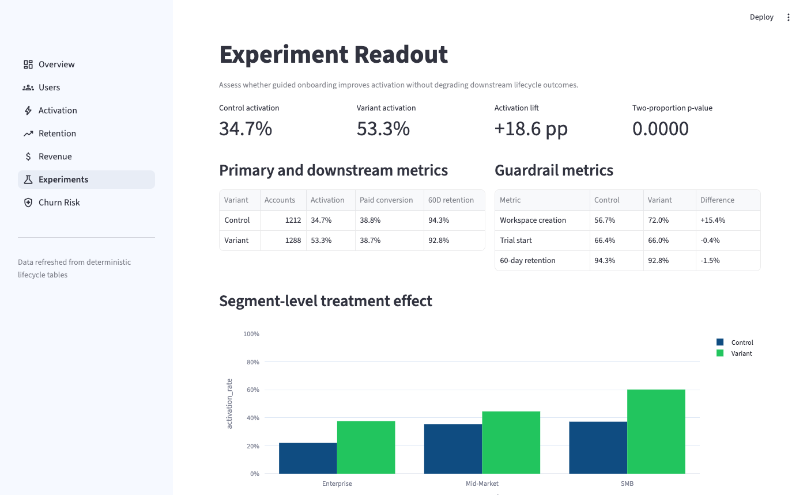
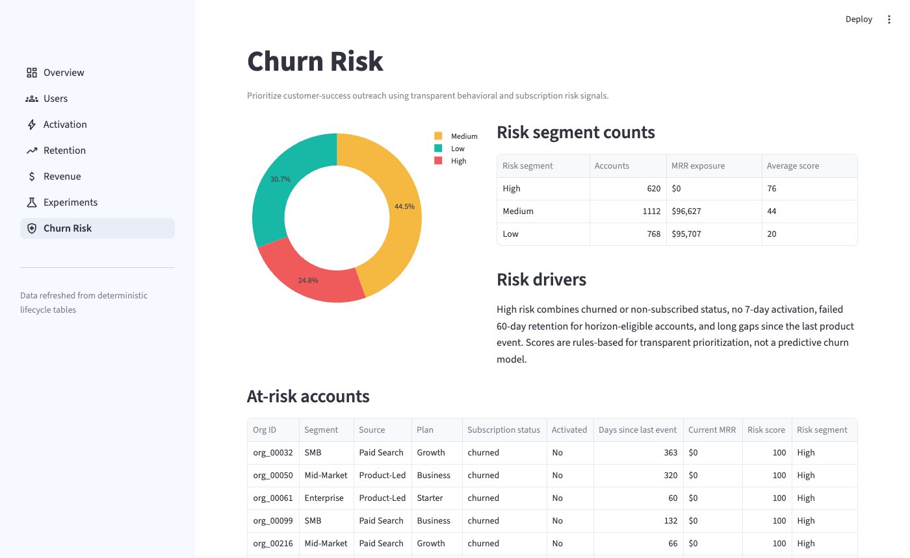

# Product-Led SaaS Lifecycle & Retention Analytics

A product analytics project that connects user behavior to activation, paid conversion, retention, and revenue outcomes — built to mirror the work of a Data Analyst III, Product Analyst, or Growth Analyst at a B2B SaaS company.

---

## Dashboard


### Run locally

```bash
# From the project root
python scripts/generate_synthetic_data.py

cd app
pip install -r requirements.txt
streamlit run Summary.py
```

---

## Business Problem

A B2B SaaS company is acquiring new users efficiently, but the customer lifecycle shows leakage after signup:

- Many accounts create a workspace but never complete a key product action within the first 7 days
- Trial users who skip onboarding milestones convert to paid at a significantly lower rate
- Retention differs meaningfully by company size, acquisition source, and early product behavior
- A new guided onboarding experiment shows a large activation lift — but the business impact varies by segment

**The core question:** Are new accounts reaching product value quickly enough to become retained, revenue-generating customers?

---

## Key Findings

| Finding                                                 | Business Implication                                      |
| ------------------------------------------------------- | --------------------------------------------------------- |
| Activation lift of +18.6 pp from guided onboarding      | New flow helps users reach value faster; strongest in SMB |
| Enterprise accounts show weaker treatment response      | Separate enterprise onboarding path needed                |
| Teammate invitations correlate with long-term retention | Add invite prompt earlier in the activation flow          |
| Paid conversion lift is smaller than activation lift    | Activation alone does not guarantee monetization          |

---

## Dashboard Pages

### Overview

Executive summary: KPI trends (vs. prior 30 days), lifecycle funnel, activation metrics, cohort retention, A/B experiment readout, NRR trend, and churn risk segments.

### Users

User distribution by role, organization size, acquisition source, and region. Signup volume over time.

### Activation

7-day activation rate by segment and acquisition source. Time-to-activation distribution. Key action breakdown (workspace creation, integration, project creation).

### Retention

30/60/90-day cohort retention curves by signup month, company size, and acquisition source. Activated vs. non-activated retention comparison.

### Revenue

MRR trend, ARPA by plan, trial-to-paid conversion funnel, and churn reason breakdown.

### Experiments



Onboarding A/B experiment readout: activation lift (+18.6 pp), two-proportion z-test p-value, downstream paid conversion and 60-day retention by variant, guardrail metrics, and segment-level treatment effects.

### Churn Risk



Rules-based risk scoring combining subscription status, 7-day activation, 60-day retention eligibility, and days since last product event. At-risk account list with CS action recommendations.

---

## Analytical Depth

| Analysis         | Method                                                                       |
| ---------------- | ---------------------------------------------------------------------------- |
| Lifecycle funnel | Stage-by-stage conversion from signup to retained                            |
| Activation       | 7-day window requiring workspace creation + key product action               |
| A/B experiment   | Two-proportion z-test, segment-level heterogeneous treatment effect analysis |
| Cohort retention | 30/60/90-day horizons for eligible paid accounts                             |
| NRR              | 60-day cohort retained MRR / beginning MRR                                   |
| Churn risk       | Rules-based scoring with transparent behavioral signals                      |
| Business impact  | Incremental MRR from targeted experiment rollout                             |

---

## Data Model

Deterministic synthetic data (seed=42) generated for 2,500 accounts across 5 tables:

```
organizations          — org_id, created_at, industry, company_size, acquisition_source, region
users                  — user_id, org_id, role, signup_timestamp, is_admin
event_logs             — event_id, user_id, org_id, event_name, event_timestamp, event_properties
subscriptions          — subscription_id, org_id, plan_type, mrr_amount, start_date, end_date, status, churn_reason
experiment_assignments — experiment_id, org_id, variant, assigned_at, eligible_segment
```

Key events: `signup_completed`, `workspace_created`, `teammate_invited`, `integration_connected`, `project_created`

---

## Tests

23 unit and integration tests covering data generation, metric logic, and page rendering:

```bash
python -m pytest tests/ -v
# 23 passed in 2.56s
```

---

## Tech Stack

| Layer                | Tool                   |
| -------------------- | ---------------------- |
| Data generation      | Python (NumPy, Pandas) |
| Metrics and analysis | Python (Pandas, SciPy) |
| Dashboard            | Streamlit + Plotly     |
| Tests                | pytest                 |
