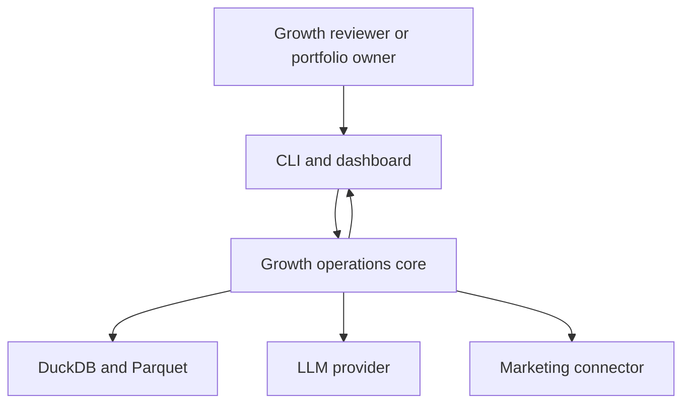
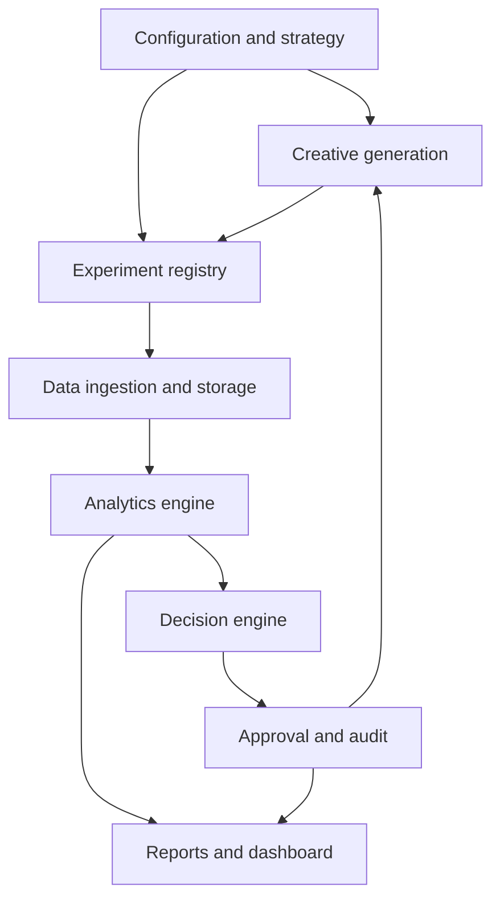
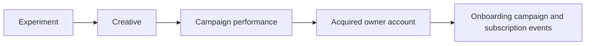
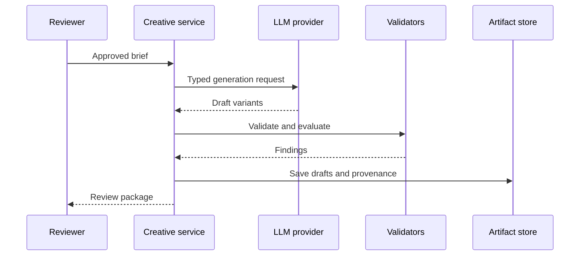
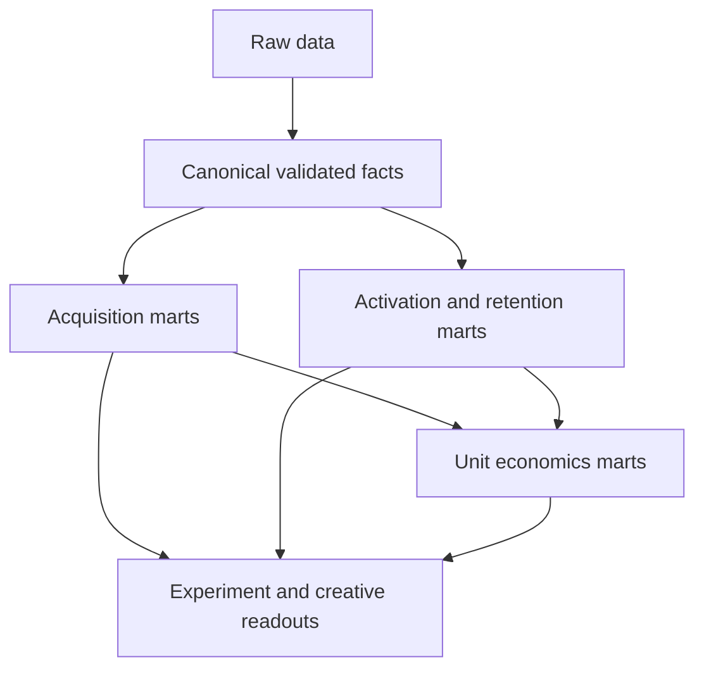
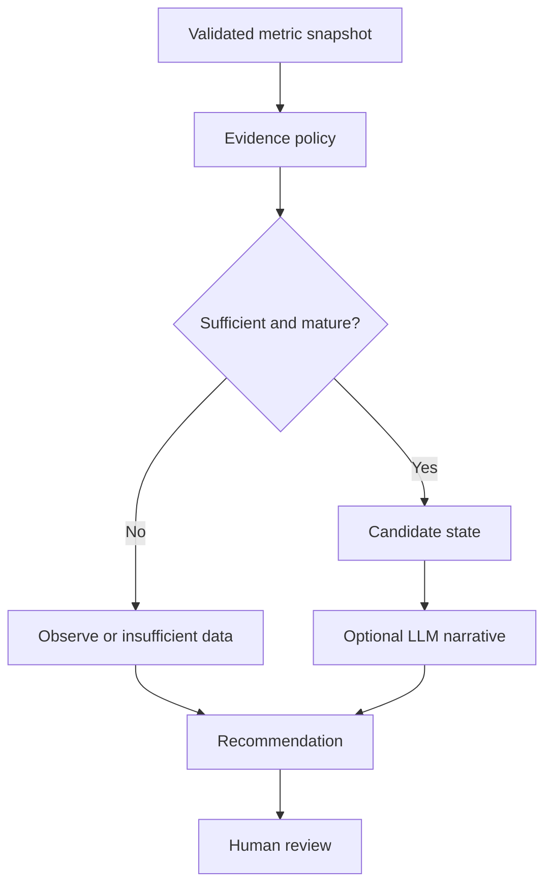
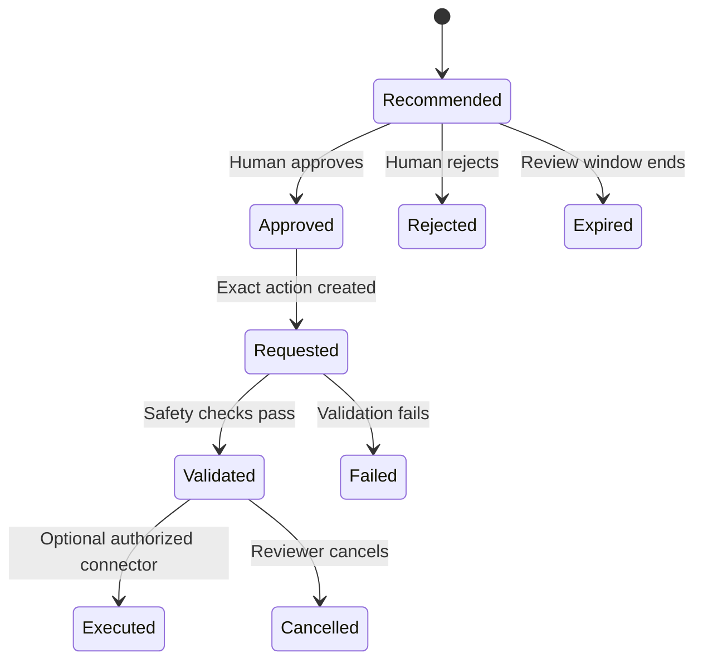
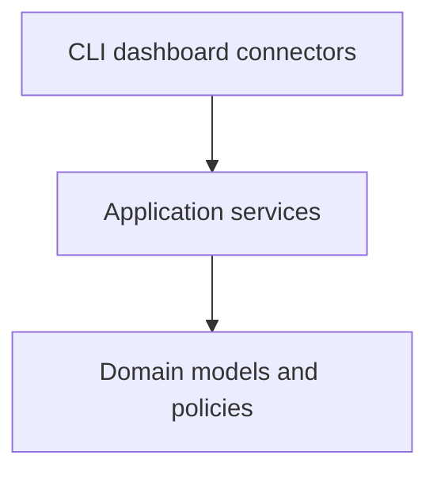

# Architecture

## AI-Powered Creative Optimization & Growth Operations Agent

**Architecture style:** Local-first modular monolith  
**Runtime:** Python 3.11+  
**Primary analytics engine:** DuckDB with Parquet  
**Default operating mode:** Synthetic data, dry-run, recommendation-only  
**Document status:** Target architecture for the portfolio MVP

## 1. Purpose

This document defines the system boundaries, module responsibilities, data flow, interfaces, storage model, safety controls, and implementation sequence for the Tablr portfolio project: a hypothetical B2B SaaS growth OS for independent restaurant owners.

The architecture is intentionally local-first. It must demonstrate sound growth, creative, analytics, and AI operations without requiring production infrastructure, paid-media credentials, or live campaign access.

The design favors:

- Clear business logic
- Reproducible analytics
- Testable interfaces
- Explicit provenance
- Human-reviewed decisions
- Replaceable external providers
- Honest simulation boundaries

## 2. Architectural Principles

### 2.1 Business reasoning before automation

Automation must implement documented business rules. It must not invent metric definitions, experiment criteria, or approval authority.

### 2.2 Deterministic calculations before LLM synthesis

Python and SQL calculate authoritative metrics. An LLM may summarize validated metric objects, explain tradeoffs, or draft next-test ideas, but it must not alter calculated values.

### 2.3 Local MVP before external integration

The entire core workflow must run with:

- Synthetic data
- Mock LLM output if no model key is available
- Mock marketing-platform connectors
- No cloud services
- No live mutations

### 2.4 Ports at external boundaries

LLM providers, marketing platforms, storage, and report renderers must be accessed through explicit interfaces so mock and real implementations can share the same contract.

### 2.5 Human approval is a separate state transition

A recommendation is not an approval. Approval is not execution. These states must remain separate in schemas, storage, commands, and audit records.

### 2.6 Provenance is part of every important output

Creative variants, metrics, experiment readouts, recommendations, and actions must preserve their source identifiers, evaluation period, configuration version, and generation or calculation timestamp.

### 2.7 Complexity must earn its place

Do not introduce distributed workers, message queues, cloud warehouses, microservices, or production orchestration into the MVP. Add infrastructure only when a documented requirement cannot be satisfied by the modular monolith.

## 3. System Context



### External actors and systems

| Actor or system     | MVP relationship                        | Advanced relationship             |
| ------------------- | --------------------------------------- | --------------------------------- |
| Portfolio owner     | Configures, runs, reviews, and explains | Same                              |
| Growth reviewer     | Approves or rejects recommendations     | May authorize draft operations    |
| LLM provider        | Mock by default; optional API           | Approved provider integration     |
| Meta                | Mock connector                          | Read-only or draft-only connector |
| TikTok              | Mock connector                          | Read-only or draft-only connector |
| Google and LinkedIn | Synthetic source only                   | Future connector                  |
| Product analytics   | Synthetic product events                | Future authorized source          |

## 4. High-Level Component Model



## 5. Architecture Layers

| Layer           | Responsibility                                          | Must not do                         |
| --------------- | ------------------------------------------------------- | ----------------------------------- |
| Configuration   | Load and validate non-secret settings and strategy      | Calculate metrics or call APIs      |
| Domain models   | Define stable business objects and invariants           | Contain vendor-specific payloads    |
| Creative        | Turn approved strategy into validated draft variants    | Publish ads or approve itself       |
| Experimentation | Register hypotheses, controls, variants, and maturity   | Rewrite hypotheses after results    |
| Connectors      | Translate external or mock data into canonical models   | Contain core growth decisions       |
| Storage         | Persist raw, canonical, analytical, and audit artifacts | Hide schema changes                 |
| Analytics       | Calculate authoritative metrics and cohort outputs      | Generate ungrounded narratives      |
| Decisioning     | Apply evidence policy and create recommendations        | Execute or approve platform actions |
| Governance      | Manage approvals, audit records, and safety policy      | Calculate marketing performance     |
| Reporting       | Present validated outputs and disclosures               | Recalculate conflicting metrics     |
| Orchestration   | Coordinate workflows and failure boundaries             | Bypass validation or approval       |

## 6. Recommended Repository Structure

```text
├── README.md
├── .env.example
├── .gitignore
│
├── process/                     # project story (human-readable, phase by phase)
│
├── docs/                        # all reference documents
│   ├── PROJECT_BRIEF.md
│   ├── PHASES.md
│   ├── AGENTS.md
│   ├── ARCHITECTURE.md
│   ├── CASE_STUDY.md
│   ├── DEMO.md
│   ├── message_map.md
│   ├── hook_taxonomy.md
│   ├── creative_testing_matrix.md
│   ├── creative_qc_checklist.md
│   ├── experiment_playbook.md
│   ├── experiment_readout.md
│   ├── evals/
│   ├── reports/
│   ├── examples/                # creative briefs, sample agent outputs
│   │   ├── creative_briefs/
│   │   ├── channel_recommendations.json
│   │   └── budget_recommendation.json
│   ├── notebooks/               # analysis notebooks
│   └── prompts/                 # LLM prompt templates
│
├── app/                         # Streamlit dashboard
│
├── data/
│   ├── config/                  # YAML configs (brand, personas, channels, experiments)
│   ├── raw/
│   ├── canonical/
│   ├── processed/
│   ├── synthetic/
│   └── data_dictionary.md
│
├── scripts/
│   ├── generate_synthetic_data.py
│   └── sql/                     # DuckDB analytical queries
│
└── tests/
    ├── unit/
    ├── data/
    └── fixtures/
```

## 7. Domain Model

Domain models should use platform-neutral names. Vendor-specific request and response objects belong inside connector modules.

### Core entities

| Entity               | Purpose                                           | Stable identifier   |
| -------------------- | ------------------------------------------------- | ------------------- |
| `Persona`            | Audience hypothesis and message constraints       | `persona_id`        |
| `CreativeBrief`      | Approved strategic input                          | `brief_id`          |
| `CreativeVariant`    | Structured draft creative                         | `creative_id`       |
| `Experiment`         | Hypothesis, control, variants, and decision rules | `experiment_id`     |
| `Campaign`           | Canonical paid campaign                           | `campaign_id`       |
| `AdGroup`            | Targeting or ad-set layer                         | `ad_group_id`       |
| `DailyPerformance`   | Daily delivery and conversion facts               | Composite grain     |
| `Account`            | Synthetic Tablr customer account                  | `account_id`        |
| `OwnerUser`          | Synthetic restaurant-owner user                   | `user_id`           |
| `RestaurantLocation` | Restaurant location associated with an account    | `location_id`       |
| `ProductEvent`       | Behavioral product event                          | `event_id`          |
| `Subscription`       | Trial and paid subscription lifecycle             | `subscription_id`   |
| `RevenueEvent`       | Observed synthetic subscription revenue event     | `revenue_event_id`  |
| `MetricSnapshot`     | Validated calculated evidence                     | `snapshot_id`       |
| `ExperimentReadout`  | Outcome and maturity assessment                   | `readout_id`        |
| `Recommendation`     | Proposed decision with evidence                   | `recommendation_id` |
| `ApprovalRecord`     | Human disposition of a recommendation             | `approval_id`       |
| `ActionRequest`      | Exact requested external mutation                 | `action_request_id` |
| `AuditEvent`         | Append-only activity history                      | `audit_event_id`    |

### Key enums

```text
Channel:
  META | TIKTOK | GOOGLE_SEARCH | LINKEDIN

RecommendationState:
  OBSERVE | REVISE | HOLD | SCALE_CANDIDATE |
  PAUSE_CANDIDATE | INSUFFICIENT_DATA

ReviewStatus:
  PENDING | APPROVED | REJECTED | EXPIRED

ActionStatus:
  NOT_REQUESTED | REQUESTED | VALIDATED | EXECUTED | FAILED | CANCELLED

DataOrigin:
  SYNTHETIC | MOCK | AUTHORIZED_EXTERNAL
```

Do not overload recommendation, review, and action status into one field.

## 8. Data Architecture

### 8.1 Storage layers

| Layer      | Format                | Purpose                                      | Mutability                         |
| ---------- | --------------------- | -------------------------------------------- | ---------------------------------- |
| Raw        | JSON/CSV/Parquet      | Original synthetic or connector payloads     | Append or replace by ingestion run |
| Canonical  | Parquet               | Platform-neutral validated records           | Rebuilt deterministically          |
| Analytical | DuckDB views/tables   | Metrics, cohorts, and readouts               | Rebuilt from canonical data        |
| Artifacts  | JSON/Markdown/Parquet | Human-readable outputs and machine contracts | Versioned by run                   |
| Audit      | JSONL or DuckDB table | State transitions and provenance             | Append-only                        |

### 8.2 Why DuckDB and Parquet

For the portfolio MVP, DuckDB and Parquet provide:

- Reproducible local analytics
- SQL-based transformation
- Efficient columnar storage
- Easy inspection and portability
- No server or cloud account requirement
- A migration path to a warehouse-oriented model

Pandas may be used for generation, validation, and presentation, but maintained analytical transformations should live in reusable functions or SQL rather than only in notebooks.

### 8.3 Canonical tables

| Table                       | Grain                                               |
| --------------------------- | --------------------------------------------------- |
| `dim_persona`               | One row per persona version                         |
| `dim_creative`              | One row per creative version                        |
| `dim_experiment`            | One row per experiment version                      |
| `dim_campaign`              | One row per canonical campaign                      |
| `dim_ad_group`              | One row per canonical targeting group               |
| `fact_daily_performance`    | One date × channel × campaign × ad group × creative |
| `dim_account`               | One row per synthetic Tablr account                 |
| `dim_user`                  | One row per synthetic restaurant-owner user         |
| `dim_location`              | One row per synthetic restaurant location           |
| `fact_product_event`        | One row per event                                   |
| `fact_revenue_event`        | One row per revenue event                           |
| `mart_acquisition`          | Configured acquisition grain                        |
| `mart_activation`           | One acquired account with 14-day activation outcome |
| `mart_retention_cohort`     | Cohort × period × selected dimensions               |
| `mart_creative_performance` | Creative × evaluation period                        |
| `mart_unit_economics`       | Cohort or segment × evaluation period               |
| `mart_experiment_readout`   | Experiment × evaluation run                         |

Exact fields and formulas belong in `data/data_dictionary.md`.

### 8.4 Required join path



The implementation must test joins for row multiplication and missing attribution. A missing join must remain visible rather than being silently dropped.

### 8.5 Money, time, and identifiers

- Use UTC internally.
- Keep timezone metadata for source interpretation.
- Use ISO 8601 timestamps.
- Store currency explicitly; the MVP default is USD.
- Use `Decimal` or integer minor units for authoritative money calculations.
- Use stable generated identifiers, not array positions.
- Include `run_id` and `data_origin` in generated artifacts.

### 8.6 Tablr business-event contract

The canonical product-event model must support these B2B SaaS events:

| Event                     | Architectural use                                                  |
| ------------------------- | ------------------------------------------------------------------ |
| `trial_signup`            | Starts the acquisition and trial cohort                            |
| `onboarding_completed`    | Measures onboarding progress                                       |
| `profile_created`         | Represents core account setup                                      |
| `campaign_launched`       | Defines MVP activation when completed within 14 days               |
| `first_customer_acquired` | Measures the first downstream customer outcome attributed to Tablr |
| `subscription_started`    | Begins paid-subscription measurement                               |
| `location_added`          | Tracks account expansion                                           |
| `revenue_generated`       | Supports MRR, LTV, payback, and NRR analysis                       |

An **Activated Owner** is a trial account that launches its first Tablr campaign within 14 days of trial signup. The primary paid-growth metric is:

```text
CPAO = Paid Media Spend / Paid-Acquired Activated Owners
```

This definition belongs in the metric source of truth and must not be changed only inside application code. Architecture must also support later comparison against stricter milestones such as `first_customer_acquired` without rewriting historical results.

Subscription analysis must preserve the account and location relationship so Month 1, Month 3, Month 6, cohort MRR, and Net Revenue Retention can be calculated without treating an added location as a newly acquired customer.

## 9. Configuration Architecture

### Configuration categories

| File or source      | Examples                                     |
| ------------------- | -------------------------------------------- |
| `.env`              | Secrets and local runtime overrides          |
| `settings.py`       | Validated environment settings               |
| `brand.yaml`        | Voice, approved claims, prohibited claims    |
| `personas.yaml`     | Audience hypotheses and message constraints  |
| `channels.yaml`     | Channel roles and mock configuration         |
| `experiments.yaml`  | Registered test definitions                  |
| `metrics.yaml`      | Thresholds, direction, and maturity settings |
| `safety_rules.yaml` | Approval and mutation policy                 |

### Configuration precedence

```text
Safe code defaults
→ Versioned non-secret configuration
→ Local environment overrides
→ Explicit command options
```

Command options must not be allowed to bypass hard safety invariants. For example, a CLI flag alone must not change `ALLOW_LIVE_MUTATIONS=false` into an authorized platform mutation.

### Required runtime settings

```env
APP_ENV=development
DATA_ORIGIN=synthetic
DRY_RUN=true
RECOMMEND_ONLY=true
ALLOW_LIVE_MUTATIONS=false
RANDOM_SEED=20260913
DEFAULT_CURRENCY=USD
DEFAULT_TIMEZONE=UTC
LLM_PROVIDER=mock
LLM_MODEL=
```

Secrets must never appear in versioned configuration.

## 10. Creative Generation Architecture

### Components

| Component           | Responsibility                                               |
| ------------------- | ------------------------------------------------------------ |
| `CreativeService`   | Coordinate brief validation, generation, QC, and persistence |
| `LLMProvider`       | Convert a typed request into a typed draft response          |
| `MockLLMProvider`   | Return deterministic fixtures for tests and demos            |
| `AnthropicProvider` | Optional configured provider adapter                         |
| `CreativeValidator` | Enforce schema, length, metadata, and channel constraints    |
| `ClaimChecker`      | Flag unsupported or prohibited claims                        |
| `DuplicateDetector` | Identify exact and near-duplicate outputs                    |

### Provider interface

```python
from typing import Protocol

class LLMProvider(Protocol):
    def generate_creatives(
        self,
        request: CreativeGenerationRequest,
    ) -> CreativeGenerationResponse:
        ...
```

The provider returns drafts only. Approval belongs outside the provider.

### Generation flow



### Prompt versioning

Every generated variant must preserve:

- Prompt template name and version
- Provider and model identifier
- Input brief identifier and version
- Generation timestamp
- Run identifier
- Validation findings
- Human-review status

Prompt text should live in versioned files rather than long inline strings.

## 11. Experimentation Architecture

### Experiment state model

```text
DRAFT → READY → RUNNING → MATURE → EVALUATED → CLOSED
                   ↘ INVALID
                   ↘ CANCELLED
```

Only valid state transitions are permitted. Changing an active experiment’s hypothesis, control, primary variable, or primary metric requires a new version and an audit event.

### Evaluation responsibilities

The experiment engine must:

- Validate experiment definitions.
- Identify control and variants.
- Check evidence requirements.
- Check cohort and conversion maturity.
- Calculate effect sizes and uncertainty.
- Evaluate guardrails.
- Produce a typed `ExperimentReadout`.
- Preserve `INSUFFICIENT_DATA` rather than forcing a winner.

The experiment engine must not:

- Generate creative content.
- Reallocate budgets.
- Approve recommendations.
- Execute platform changes.

## 12. Analytics Architecture

### Analytical flow



### Module ownership

| Module                     | Owns                                                 |
| -------------------------- | ---------------------------------------------------- |
| `campaign_metrics.py`      | CPM, CTR, CPC, CVR, trial CAC, CPAO, ROAS            |
| `creative_intelligence.py` | Attribute rollups, quality, fatigue signals          |
| `cohorts.py`               | Cohort membership and maturity                       |
| `retention.py`             | Month 1, Month 3, and Month 6 subscription retention |
| `ltv.py`                   | Observed revenue and modeled LTV                     |
| `budget_allocator.py`      | Constrained simulation of allocation options         |
| `data_quality.py`          | Completeness, validity, and anomaly findings         |

### Metric calculation contract

Every calculated metric object should include:

```text
metric_name
metric_value
numerator
denominator
unit
grain
period_start
period_end
calculation_version
data_origin
data_maturity
source_snapshot_id
```

This makes ratios auditable and prevents a dashboard or LLM from presenting an unexplained number.

### Retention maturity

Retention functions must determine whether a cohort has had sufficient time to reach the requested subscription window. An immature Month 3 or Month 6 cohort must be represented as immature, not as churned or zero retained accounts.

### LTV separation

Maintain separate fields and labels for:

- Observed revenue to date
- Observed value per user
- Projected LTV
- Projection method
- Projection horizon
- Sensitivity range

Do not combine observed and modeled values into an unlabeled `ltv` field.

## 13. Decisioning Architecture

### Two-stage decision system

#### Stage 1: Deterministic evidence policy

Python evaluates:

- Data validity
- Minimum evidence
- Evaluation maturity
- Primary and guardrail metrics
- Downstream activation and retention
- Conflicting signals
- Eligibility for each recommendation state

#### Stage 2: Grounded narrative synthesis

An optional LLM receives an immutable validated evidence summary and drafts:

- Rationale
- Tradeoffs
- Risks
- Plain-language explanation
- Next-test proposal

The final recommendation preserves the deterministic evidence and identifies the narrative generator separately.

### Decision flow



### Recommendation contract

A recommendation includes:

- `recommendation_id`
- `recommendation_state`
- `subject_type` and `subject_id`
- `evaluation_period`
- `metric_snapshot_ids`
- `experiment_readout_id`, when applicable
- `evidence_quality`
- `maturity_status`
- `rationale`
- `tradeoffs`
- `risks`
- `next_action`
- `review_status`
- `created_by`
- `created_at`
- `run_id`

## 14. Governance and Approval Architecture

### Separation of states



For the MVP, the normal terminal point is `Approved` or `Rejected`. External execution is optional and outside the core portfolio requirement.

### Approval invariants

- A recommendation cannot approve itself.
- Approval must identify a human reviewer.
- Approval must reference an immutable recommendation version.
- An action request must name the exact object and proposed change.
- An expired approval cannot authorize execution.
- Changing the action invalidates the prior approval.
- Execution requires a connector that explicitly supports the action.
- `ALLOW_LIVE_MUTATIONS=false` blocks execution regardless of recommendation state.

### Audit events

Audit events are append-only and contain:

- `audit_event_id`
- `event_type`
- `entity_type`
- `entity_id`
- `previous_state`
- `new_state`
- `actor_type`
- `actor_id`
- `timestamp`
- `run_id`
- `reason`
- Redacted metadata

Do not store credentials, authorization headers, or raw secret-bearing payloads in audit records.

## 15. Connector Architecture

### Marketing connector interface

```python
from typing import Protocol

class MarketingConnector(Protocol):
    capabilities: ConnectorCapabilities

    def fetch_performance(
        self,
        request: PerformanceRequest,
    ) -> PerformanceResponse:
        ...

    def create_draft(
        self,
        request: DraftCampaignRequest,
    ) -> DraftCampaignResponse:
        ...
```

The MVP mock connector may implement both methods. An external connector must declare its capabilities explicitly. The absence of a capability must fail closed.

### Capability model

```text
READ_PERFORMANCE
CREATE_DRAFT
UPDATE_DRAFT
ACTIVATE_CAMPAIGN
CHANGE_BUDGET
PAUSE_ENTITY
UPLOAD_AUDIENCE
```

For the portfolio MVP, only `READ_PERFORMANCE` and mock `CREATE_DRAFT` are required. External `CREATE_DRAFT` is optional. All other external capabilities remain unsupported unless separately authorized and designed.

### Idempotency

Every write-like operation must use an idempotency key derived from stable inputs such as:

```text
connector + operation + account_scope + entity_spec_hash + approved_action_id
```

Store the key and prior result before retrying. Repeated requests must return or reconcile the existing result rather than creating duplicates.

### Raw payload handling

- Preserve sanitized raw responses for debugging when useful.
- Remove tokens and sensitive identifiers.
- Validate and map into canonical domain models.
- Quarantine invalid records rather than silently coercing them.
- Record connector and schema versions.

## 16. Orchestration Architecture

### Run context

Every pipeline run should create a `RunContext` containing:

- `run_id`
- `started_at`
- `command`
- `app_environment`
- `data_origin`
- `dry_run`
- `recommend_only`
- `allow_live_mutations`
- Configuration fingerprint
- Code or package version when available

### Primary workflows

#### Generate synthetic data

```text
Load configuration
→ Validate synthetic scenario
→ Generate canonical entities and facts
→ Run data-quality validation
→ Write Parquet
→ Record run manifest
```

#### Generate creative variants

```text
Load approved brief
→ Validate strategic fields
→ Call configured provider
→ Validate and evaluate drafts
→ Save creative artifacts
→ Request human review
```

#### Analyze performance

```text
Load validated canonical data
→ Build analytical marts
→ Calculate metric snapshots
→ Evaluate experiments
→ Write readouts
```

#### Produce recommendations

```text
Load validated snapshots and readouts
→ Apply evidence policy
→ Create candidate state
→ Optionally synthesize narrative
→ Save recommendation
→ Await human review
```

#### Produce weekly review

```text
Load frozen reporting snapshot
→ Render scorecard and findings
→ Include decisions and uncertainty
→ Include next tests
→ Attach simulation disclosure
```

### Transaction boundaries

Each workflow should write to a temporary or run-scoped location and expose final artifacts only after required validation succeeds. Partial results must be marked failed and must not appear as approved outputs.

## 17. CLI Architecture

The CLI is the primary MVP interface. A thin script may delegate to the package CLI.

Recommended commands:

```bash
growth-agent data generate --seed 20260913
growth-agent data validate
growth-agent creative generate --brief-id BRIEF_ID --dry-run
growth-agent experiment validate --experiment-id EXPERIMENT_ID
growth-agent analytics build
growth-agent analytics report --period weekly
growth-agent recommend create --subject-id SUBJECT_ID --recommend-only
growth-agent recommend review --recommendation-id ID --decision approve
growth-agent demo run
```

### CLI safety

- Safe modes are the default and need no flag.
- Potentially external operations must state the connector and target.
- A command must print whether data is synthetic, mock, or external.
- A command must never infer approval from an interactive confirmation alone.
- The MVP should not expose a live-mutation command.

Typer is a suitable CLI framework, but its adoption should be recorded in `DECISIONS.md`. Standard-library `argparse` remains an acceptable lower-dependency alternative.

## 18. Reporting and Dashboard Architecture

### Reporting source

Reports and dashboards must read from validated analytical marts or frozen report snapshots. They must not implement independent metric formulas.

### Required views

- Executive growth scorecard
- Acquisition funnel
- Trial activation and CPAO
- Channel and persona quality
- Creative attributes and fatigue
- Month 1, Month 3, and Month 6 subscription cohorts
- Observed revenue and projected LTV
- Experiment readouts
- Recommendation and review queue
- Budget-allocation scenarios

### Required disclosures

Every portfolio-facing report must show:

- Synthetic or simulated status
- Data period
- Last refresh time
- Metric-definition reference
- Maturity warning where applicable
- Projection label where applicable

Streamlit is the recommended MVP dashboard because it supports a local Python workflow with limited additional infrastructure. Record the final dashboard choice in `DECISIONS.md` before implementation.

## 19. Error Handling and Reliability

### Error categories

| Category      | Example                             | Expected response                       |
| ------------- | ----------------------------------- | --------------------------------------- |
| Configuration | Missing required non-secret setting | Fail fast with corrective message       |
| Validation    | Invalid creative or experiment      | Reject before persistence               |
| Data quality  | Broken foreign key                  | Quarantine or fail the analytical build |
| Provider      | Timeout or invalid LLM output       | Bounded retry, then fail safely         |
| Connector     | Rate limit or expired token         | Backoff or stop; never bypass auth      |
| Decisioning   | Insufficient evidence               | Return explicit non-action state        |
| Approval      | Expired or mismatched approval      | Block action request                    |
| Reporting     | Missing mature cohort               | Render a warning, not a zero            |

### Retry policy

- Retry only failures likely to be transient.
- Use bounded exponential backoff with jitter for external calls.
- Do not retry validation or permission failures automatically.
- Preserve idempotency across retries.
- Record the final failure without secrets.

## 20. Observability and Provenance

### Structured logging fields

- Timestamp
- Log level
- Event name
- Run ID
- Component
- Entity type and sanitized identifier
- Outcome
- Duration
- Error category

### Run manifest

Each material run should write a manifest containing:

- Input artifact versions or hashes
- Configuration fingerprint
- Code version when available
- Provider and model information when used
- Output paths and hashes
- Validation results
- Warnings and limitations
- Start and completion timestamps

### Redaction

Use a shared redaction function at logging and connector boundaries. Do not rely on individual call sites to remember every sensitive field.

## 21. Testing Architecture

### Test pyramid

| Level               | Focus                               | External calls                |
| ------------------- | ----------------------------------- | ----------------------------- |
| Unit                | Formulas, schemas, state rules      | None                          |
| Data                | Quality, joins, reproducibility     | None                          |
| Contract            | Provider and connector interfaces   | Mocked                        |
| Integration         | Module boundaries and DuckDB builds | None                          |
| End-to-end          | Complete local demo                 | Mock only                     |
| Optional live smoke | Authorized read or draft operation  | Explicit and excluded from CI |

### Required architectural tests

- Safe defaults cannot be overridden accidentally.
- Synthetic generation is reproducible.
- Invalid domain models fail before persistence.
- Analytical joins do not multiply rows unexpectedly.
- Authoritative metrics match hand-calculated fixtures.
- LLM narrative cannot mutate metric values.
- Recommendation cannot approve itself.
- Approval cannot execute without an exact action request.
- Mock connector is idempotent.
- External credentials are not required for the local demo.
- Audit records exist for all governed state transitions.

## 22. Security and Privacy Boundaries

### Secrets

- Load secrets from environment variables or an approved secret store.
- Never serialize settings objects containing secrets.
- Never include secret values in exceptions.
- Never store `.env` in Git.

### Data

- Use synthetic users and fictional identifiers.
- Do not ingest real customer lists.
- Do not include platform account IDs in public fixtures.
- Sanitize screenshots and notebook outputs.

### Permissions

Model permissions separately for:

- Read reporting data
- Create drafts
- Update drafts
- Activate or mutate delivery
- Upload audience data

The presence of credentials does not imply permission to use every capability.

## 23. Dependency Direction

Dependencies should point inward toward stable domain logic.



Domain modules must not import:

- Marketing platform SDKs
- Dashboard frameworks
- CLI frameworks
- LLM provider SDKs
- Filesystem-specific storage adapters

Adapters may import domain contracts. Domain contracts must not import adapters.

## 24. MVP Deployment Model

The MVP is a local application:

```text
Developer machine or GitHub Codespace
├── Python application
├── DuckDB database
├── Parquet datasets
├── Local artifacts
└── Optional local dashboard
```

GitHub Actions performs static checks and tests. It must not call live ad platforms or paid LLM APIs.

No hosted deployment is required to complete the portfolio. A hosted dashboard may be added later only after synthetic-data disclosure and secret handling are reviewed.

## 25. Evolution Path

### MVP

- Synthetic data
- Mock LLM provider
- Optional configured LLM provider
- Mock Meta and TikTok connectors
- DuckDB and Parquet
- CLI
- Local dashboard
- Human-reviewed recommendations

### Optional portfolio extension

- Authorized read-only connector
- Authorized draft-only connector
- Scheduled local or CI-generated weekly report
- Additional creative evaluation cases

### Production-oriented future state

- Managed warehouse
- Orchestrator and job scheduler
- Central secret manager
- Role-based access control
- Production observability
- Formal data contracts
- Incrementality measurement
- Approved platform mutation service

The future state is explanatory only. Do not build it as part of the MVP without a new decision and explicit scope.

## 26. Initial Architectural Decisions

The following decisions are recommended for acceptance in `DECISIONS.md`:

| ID      | Decision                                                   | Rationale                                                  |
| ------- | ---------------------------------------------------------- | ---------------------------------------------------------- |
| ADR-001 | Use a local-first modular monolith                         | Simplifies testing and portfolio use                       |
| ADR-002 | Use DuckDB and Parquet                                     | Provides reproducible SQL analytics without infrastructure |
| ADR-003 | Use a `src/` package layout                                | Prevents accidental imports and clarifies boundaries       |
| ADR-004 | Calculate metrics deterministically                        | Preserves accuracy and auditability                        |
| ADR-005 | Use LLMs only for structured drafts and grounded narrative | Limits hallucination risk                                  |
| ADR-006 | Implement mock providers and connectors first              | Removes credential and availability dependencies           |
| ADR-007 | Keep recommendation, approval, and action separate         | Prevents unsafe automation                                 |
| ADR-008 | Keep live mutations outside the MVP                        | Protects against spending and operational risk             |
| ADR-009 | Use an append-only audit history                           | Preserves provenance and reviewability                     |
| ADR-010 | Use Streamlit for the local dashboard                      | Fits the local Python portfolio workflow                   |

These are architecture recommendations until recorded as accepted decisions.

## 27. Architecture Fitness Checks

The architecture remains healthy when:

- The local demo runs without external credentials.
- Business rules are testable without the CLI, dashboard, or APIs.
- Connector SDK changes do not alter domain models unnecessarily.
- The LLM can be replaced by a mock without changing core analytics.
- Reports use the same validated metric layer.
- Missing evidence produces a non-action state.
- A recommendation cannot become an external mutation without human approval.
- Every important output can be traced to source data and configuration.
- Synthetic status remains visible throughout the workflow.

## 28. Architecture Definition of Done

This architecture is ready for implementation when:

- The user accepts or revises the initial architectural decisions.
- `DECISIONS.md` records accepted choices.
- `data/data_dictionary.md` defines the canonical fields and formulas for Phase 1.
- The Phase 0 repository scaffold matches the approved module boundaries.
- Safety defaults and state transitions have automated tests.
- No unresolved decision blocks the active phase.

Implementation must then proceed one phase in `PHASES.md` at a time. An agent must not use this architecture as permission to build the entire roadmap in one task.
